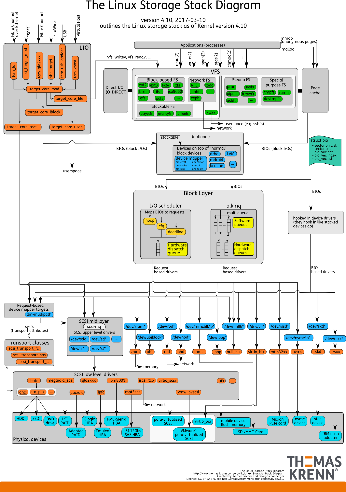

## 磁盘与文件

#### 磁盘

​	磁盘是可以持久存储的设备，根据存储介质的不同，常见磁盘可以分为两类：机械磁盘和固态磁盘

​	**机械磁盘**，也称为硬盘驱动器，通常缩写为HDD。机械磁盘主要有盘片和读写磁头组成，数据就存储在盘片的环状磁道中。在读写数据前，需要移动读写磁头，定位到数据所在的磁道，然后才能访问数据。最小读写单位是 **扇区** ，一般大小为512字节。

​	**固态磁盘**，通常缩写为SSD，有固态电子元器件组成。固态磁盘不需要磁道寻址，所以，不管是连续I/O还是随机I/O的性能，都比机械磁盘要好得多。

​	**连续 I/O 还可以通过预读的方式，来减少I/O请求的次数**，这也是其性能优异的一个原因。很多性能优化的方案，也都会从这个角度出发，来优化I/O性能。最小读写单位是 页，通常大小是 4KB ，8KB 等。

#### 磁盘调度

​	磁盘访问延迟 = 队列时间 + 控制器时间 + 寻道时间 + 旋转时间 + 传输时间

​	磁盘调度的目的是减小延迟，其中前两项可以忽略，寻道时间是主要矛盾。

#### 磁盘调度算法

- `FCFS`：先进先出的调度策略，这个策略具有公平的优点，因为每个请求都会得到处理，并且是按照接收到的顺序进行处理。
- `SSTF(Shortest-seek-time First 最短寻道时间优先)`：选择使磁头从当前位置开始移动最少的磁盘I/O请求，所以 SSTF 总是选择导致最小寻道时间的请求。总是选择最小寻找时间并不能保证平均寻找时间最小，但是能提供比 FCFS 算法更好的性能，会存在饥饿现象（会导致较远的I/O请求不能满足）。
- `SCAN`：SSTF+中途不回折，每个请求都有处理机会。SCAN 要求磁头仅仅沿一个方向移动，并在途中满足所有未完成的请求，直到它到达这个方向上的最后一个磁道，或者在这个方向上没有其他请求为止。由于磁头移动规律与电梯运行相似，SCAN 也被称为`电梯算法`。

> SCAN 算法对最近扫描过的区域不公平，因此，它在访问局部性方面不如 FCFS 算法和 SSTF 算法好。

- `C-SCAN`：SCAN+直接移到另一端，两端请求都能很快处理。把扫描限定在一个方向，当访问到某个方向的最后一个磁道时，磁道返回磁盘相反方向磁道的末端，并再次开始扫描。其中“C”是Circular（环）的意思。
- `LOOK(C-LOOK)`：釆用SCAN算法和C-SCAN算法时磁头总是严格地遵循从盘面的一端到另一端，显然，在实际使用时还可以改进，**即磁头移动只需要到达最远端的一个请求即可返回，不需要到达磁盘端点**。这种形式的SCAN算法和C-SCAN算法称为LOOK和C-LOOK调度。这是因为它们在朝一个给定方向移动前会查看是否有请求。

#### 文件系统

​	文件系统是对存储设备上的文件，进行组织管理的一种机制。而 Linux 在各种文件系统实现上，抽象了一层虚拟文件系统 VFS ，它定义了一组，所有文件系统都支持的，数据结构和标准接口。VFS 内部通过目录项，索引节点，逻辑块以及超级块等数据结构，来管理文件。

- 目录项：记录了文件的名字，以及文件与其他目录项之间的目录关系。
- 索引节点：记录了文件的元数据
- 逻辑块：是由连续磁盘扇区构成的最小读写单元，用来存储文件系统
- 超级块：用来记录文件系统整体的状态，如索引节点和逻辑块的使用情况等。

   其中，目录项是一个内存缓存；而超级块，索引节点和逻辑块，都是存储在磁盘中的持久数据。

​	如果每次都读写 512 字节这么小的单位的话，效率很低。所以，文件系统会把连续的扇区或页，组成逻辑块，然后以逻辑块作为最小单元来管理数据。常见的逻辑块的大小是 4KB ，也就是连续8个扇区，或者单独的一个页，都可以组成一个逻辑块。

#### 通用块层

​	为了减小不同块设备的差异带来的影响，Linux 通过一个统一的通用块层，来管理各种不同的块设备。 通用块层，其实是处在文件系统和磁盘驱动中间的一个块设备抽象层。它主要有两个功能：

- 同虚拟文件系统的功能类似：向上，为文件系统和应用程序，提供访问块设备的标准接口；向下，把各种异构的磁盘设备抽象为统一的块设备，并提供统一框架来管理这些设备的驱动程序。
- I/O调度：对文件系统和应用程序发来的I/O请求排队，并通过重新排序，请求合并等方式，提高磁盘读写的效率。Linux 内核支持四种 I/O 调度算法，分别是 NONE , NOOP , CFQ 以及 DeadLine

#### IO 栈

​	可以把 Linux 存储系统的I/O栈，由上到下分为三个层次，分别是文件系统层，通用块层和设备层。

  

- **文件系统层**：包括虚拟文件系统和其他各种文件系统的具体实现。它为上层的应用程序，提供标准的文件访问接口；对下会通过调用块层，来存储和管理磁盘数据。
- **调用块层**：包扣块设备I/O队列和I/O调度器。它会对文件系统的I/O请求进行排队，再通过重新排序和请求合并，然后才要发送给下一级的设备层。
- **设备层**：包扣存储设备和相应的驱动程序，负责最终物理设备的I/O操作。

### Linux文件权限

​	Linux文件采用10个标志位来表示文件权限，如下所示：

```
-rw-r--r--  1 skyline  staff    20B  1 27 10:34 1.txt
drwxr-xr-x   5 skyline  staff   170B 12 23 19:01 ABTableViewCell
```

第一个字符一般用来区分文件和目录，其中：

- d：表示是一个目录，事实上在ext2fs中，目录是一个特殊的文件。
- －：表示这是一个普通的文件。
- l: 表示这是一个符号链接文件，实际上它指向另一个文件。
- b、c：分别表示区块设备和其他的外围设备，是特殊类型的文件。
- s、p：这些文件关系到系统的数据结构和管道，通常很少见到。

第2～10个字符当中的每3个为一组，左边三个字符表示所有者权限，中间3个字符表示与所有者同一组的用户的权限，右边3个字符是其他用户的权限。

这三个一组共9个字符，代表的意义如下：

- r(Read，读取)：对文件而言，具有读取文件内容的权限；对目录来说，具有浏览目录的权限
- w(Write,写入)：对文件而言，具有新增、修改文件内容的权限；对目录来说，具有删除、移动目录内文件的权限。
- x(eXecute，执行)：对文件而言，具有执行文件的权限；对目录来说该用户具有进入目录的权限。

权限的掩码可以使用十进制数字表示：

- 如果可读，权限是二进制的100，十进制是4；
- 如果可写，权限是二进制的010，十进制是2；
- 如果可运行，权限是二进制的001，十进制是1；

##### chmod命令

chmod命令非常重要，用于改变文件或目录的访问权限。用户用它控制文件或目录的访问权限。

该命令有两种用法。一种是包含字母和操作符表达式的文字设定法；另一种是包含数字的数字设定法。

1. 文字设定法

chmod ［who］ ［+ | - | =］ ［mode］ 文件名

命令中各选项的含义为：

操作对象who可是下述字母中的任一个或者它们的组合：

- u 表示“用户（user）”，即文件或目录的所有者。
- g 表示“同组（group）用户”，即与文件属主有相同组ID的所有用户。
- o 表示“其他（others）用户”。
- a 表示“所有（all）用户”。它是系统默认值。

操作符号可以是：

- - 添加某个权限。
- - 取消某个权限。
- = 赋予给定权限并取消其他所有权限（如果有的话）。

设置mode所表示的权限可用下述字母的任意组合：

- r 可读。
- w 可写。
- x 可执行。
- X 只有目标文件对某些用户是可执行的或该目标文件是目录时才追加x 属性。
- s 在文件执行时把进程的属主或组ID置为该文件的文件属主。方式“u＋s”设置文件的用户ID位，“g＋s”设置组ID位。
- t 保存程序的文本到交换设备上。
- u 与文件属主拥有一样的权限。
- g 与和文件属主同组的用户拥有一样的权限。
- o 与其他用户拥有一样的权限。

文件名：以空格分开的要改变权限的文件列表，支持通配符。

在一个命令行中可给出多个权限方式，其间用逗号隔开。例如：`chmod g+r，o+r example` 使同组和其他用户对文件example 有读权限。

1. 数字设定法

直接使用数字表示的权限来更改：

```
例： $ chmod 644 mm.txt
```

##### chgrp命令

功能：改变文件或目录所属的组。

语法：chgrp ［选项］ group filename

```
例：$ chgrp - R book /opt/local /book
```

改变/opt/local /book/及其子目录下的所有文件的属组为book。

##### chown命令

功能：更改某个文件或目录的属主和属组。这个命令也很常用。例如root用户把自己的一个文件拷贝给用户xu，为了让用户xu能够存取这个文件，root用户应该把这个文件的属主设为xu，否则，用户xu无法存取这个文件。

语法：chown ［选项］ 用户或组 文件

说明：chown将指定文件的拥有者改为指定的用户或组。用户可以是用户名或用户ID。组可以是组名或组ID。文件是以空格分开的要改变权限的文件列表，支持通配符。

```
例：把文件shiyan.c的所有者改为wang。

    chown wang shiyan.c
```