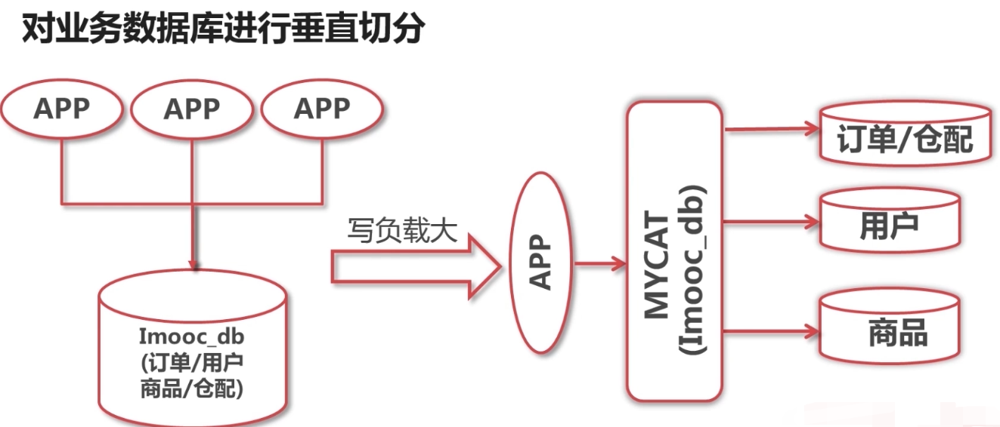
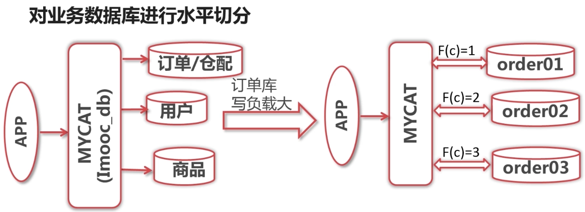
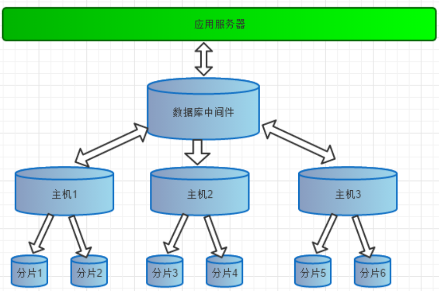

#### **序言**

  随着互联网发展，数据量越来越大，对性能要求越来越高，传统数据库存在着先天性的缺陷，即单机（单库）性能瓶颈，并且扩展困难。这样既有单机单库瓶颈，却又扩展困难，自然无法满足日益增长的海量数据存储及其性能要求。如果传统数据易于扩展，可切分，就可以避免单机（单库）的性能缺陷，但是由于目前开源或者商用的传统数据库基本不支持大规模自动扩展，所以就需要借助第三方来做处理。也就是需要进行数据切分。

#### **数据切分**

  数据的切分（Sharding）根据其切分规则的类型，可以分为两种切分模式。一种是按照不同的表（或者Schema）来切分到不同的数据库（主机）之上，这种切可以称之为数据的垂直（纵向）切分；另外一种则是根据表中的数据的逻辑关系，将同一个表中的数据按照某种条件拆分到多台数据库（主机）上面，这种切分称之为数据的水平（横向）切分。

  垂直切分的最大特点就是规则简单，实施也更为方便，尤其适合各业务之间的耦合度非常低，相互影响很小，业务逻辑非常清晰的系统。在这种系统中，可以很容易做到将不同业务模块所使用的表分拆到不同的数据库中。根据不同的表来进行拆分，对应用程序的影响也更小，拆分规则也会比较简单清晰。

  水平切分于垂直切分相比，相对来说稍微复杂一些。因为要将同一个表中的不同数据拆分到不同的数据库中，对于应用程序来说，拆分规则本身就较根据表名来拆分更为复杂，后期的数据维护也会更为复杂一些。

 

 

什么是Mycat?

- mycat是一个数据库中间层
- 实现对后端数据库的分库分表和读写分离
- 实现对前端应用隐藏后端数据库的存储逻辑

Mycat 原理

  它拦截了用户发送过来的SQL语句，首先对SQL语句做了一些特定的分析：如分片分析、路由分析、读写分离分析、缓存分析等，然后将此SQL 发往后端的真实数据库，并将返回的结果做适当的处理，最终再返回给用户。

 

Mycat的主要作用：

•单纯的读写分离，此时配置最为简单，支持读写分离，主从切换；

•分表分库，对于超过1000万的表进行分片，最大支持1000亿的单表分片；

•多租户应用，一个应用一个库，但应用程序只连接Mycat，从而不改造程序本身，实现多租户化；

•报表系统，借助于Mycat的分表能力，处理大规模报表的统计；

•替代Hbase，分析大数据；

•作为海量数据实时查询的一种简单有效方案，比如100亿条频繁查询的记录需要在3秒内查询出来结果，除了基于主键的查询，还可能存在范围查询或其他属性查询，此时Mycat 可能是最简单有效的选择。

