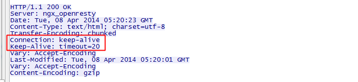

一道经典的面试题是从 URL 在浏览器被被输入到页面展现的过程中发生了什么，大多数回答都是说请求响应之后 DOM 怎么被构建，被绘制出来。但是你有没有想过，收到的 HTML 如果包含几十个图片标签，这些图片是以什么方式、什么顺序、建立了多少连接、使用什么协议被下载下来的呢？

要搞懂这个问题，我们需要先解决下面五个问题：

1.  现代浏览器在与服务器建立了一个 TCP 连接后是否会在一个 HTTP 请求完成后断开？什么情况下会断开？
2.  一个 TCP 连接可以对应几个 HTTP 请求？
3.  一个 TCP 连接中 HTTP 请求发送可以一起发送么（比如一起发三个请求，再三个响应一起接收）？
4.  为什么有的时候刷新页面不需要重新建立 SSL 连接？
5.  浏览器对同一 Host 建立 TCP 连接到数量有没有限制？

**1.现代浏览器在与服务器建立了一个 TCP 连接后是否会在一个 HTTP 请求完成后断开？什么情况下会断开？**

在 HTTP/1.0 中，一个服务器在发送完一个 HTTP 响应后，会断开 TCP 链接。但是这样每次请求都会重新建立和断开 TCP 连接，代价过大。所以虽然标准中没有设定，某些服务器对 Connection: keep-alive 的 Header 进行了支持。意思是说，完成这个 HTTP 请求之后，不要断开 HTTP 请求使用的 TCP 连接。这样的好处是连接可以被重新使用，之后发送 HTTP 请求的时候不需要重新建立 TCP 连接，以及如果维持连接，那么 SSL 的开销也可以避免.

两张图片是我短时间内两次访问[https://www.github.com](https://link.zhihu.com/?target=https%3A//www.github.com)的时间统计：

头一次访问，有初始化连接和 SSL 开销

初始化连接和 SSL 开销消失了，说明使用的是同一个 TCP 连接

持久连接：既然维持 TCP 连接好处这么多，HTTP/1.1 就把 Connection 头写进标准，并且默认开启持久连接，除非请求中写明 Connection: close，那么浏览器和服务器之间是会维持一段时间的 TCP 连接，不会一个请求结束就断掉。

所以第一个问题的答案是：默认情况下建立 TCP 连接不会断开，只有在请求报头中声明 Connection: close 才会在请求完成后关闭连接。

**2.一个 TCP 连接可以对应几个 HTTP 请求？**

了解了第一个问题之后，其实这个问题已经有了答案，如果维持连接，一个 TCP 连接是可以发送多个 HTTP 请求的。

**3.一个 TCP 连接中 HTTP 请求发送可以一起发送么（比如一起发三个请求，再三个响应一起接收）？**

HTTP/1.1 存在一个问题，单个 TCP 连接在同一时刻只能处理一个请求，意思是说：两个请求的生命周期不能重叠，任意两个 HTTP 请求从开始到结束的时间在同一个 TCP 连接里不能重叠。

虽然 HTTP/1.1 规范中规定了[Pipelining](https://link.zhihu.com/?target=https%3A//tools.ietf.org/html/rfc2616%23section-8.1.2.2)来试图解决这个问题，但是这个功能在浏览器中默认是关闭的。

先来看一下 Pipelining 是什么，RFC 2616 中规定了：

> A client that supports persistent connections MAY "pipeline" its requests (i.e., send multiple requests without waiting for each response). A server MUST send its responses to those requests in the same order that the requests were received.  
> 一个支持持久连接的客户端可以在一个连接中发送多个请求（不需要等待任意请求的响应）。收到请求的服务器必须按照请求收到的顺序发送响应。

至于标准为什么这么设定，我们可以大概推测一个原因：由于 HTTP/1.1 是个文本协议，同时返回的内容也并不能区分对应于哪个发送的请求，所以顺序必须维持一致。比如你向服务器发送了两个请求`GET /query?q=A`和`GET /query?q=B`，服务器返回了两个结果，浏览器是没有办法根据响应结果来判断响应对应于哪一个请求的。

Pipelining 这种设想看起来比较美好，但是在实践中会出现许多问题：

-   一些代理服务器不能正确的处理 HTTP Pipelining。
-   正确的流水线实现是复杂的。
-   Head-of-line Blocking 连接头阻塞：在建立起一个 TCP 连接之后，假设客户端在这个连接连续向服务器发送了几个请求。按照标准，服务器应该按照收到请求的顺序返回结果，假设服务器在处理首个请求时花费了大量时间，那么后面所有的请求都需要等着首个请求结束才能响应。
-   所以现代浏览器默认是不开启 HTTP Pipelining 的。
    
    但是，HTTP2 提供了 Multiplexing 多路传输特性，可以在一个 TCP 连接中同时完成多个 HTTP 请求。至于 Multiplexing 具体怎么实现的就是另一个问题了。我们可以看一下使用 HTTP2 的效果。
    

所以这个问题也有了答案：在 HTTP/1.1 存在 Pipelining 技术可以完成这个多个请求同时发送，但是由于浏览器默认关闭，所以可以认为这是不可行的。在 HTTP2 中由于 Multiplexing 特点的存在，多个 HTTP 请求可以在同一个 TCP 连接中并行进行。

那么在 HTTP/1.1 时代，浏览器是如何提高页面加载效率的呢？主要有下面两点：

1.  维持和服务器已经建立的 TCP 连接，在同一连接上顺序处理多个请求。
2.  和服务器建立多个 TCP 连接。

**4.为什么有的时候刷新页面不需要重新建立 SSL 连接？**

在第一个问题的讨论中已经有答案了，TCP 连接有的时候会被浏览器和服务端维持一段时间。TCP 不需要重新建立，SSL 自然也会用之前的。

**5.浏览器对同一 Host 建立 TCP 连接到数量有没有限制？**

假设我们还处在 HTTP/1.1 时代，那个时候没有多路传输，当浏览器拿到一个有几十张图片的网页该怎么办呢？肯定不能只开一个 TCP 连接顺序下载，那样用户肯定等的很难受，但是如果每个图片都开一个 TCP 连接发 HTTP 请求，那电脑或者服务器都可能受不了，要是有 1000 张图片的话总不能开 1000 个TCP 连接吧，你的电脑同意 NAT 也不一定会同意。

所以答案是：有。Chrome 最多允许对同一个 Host 建立六个 TCP 连接。不同的浏览器有一些区别。

**回到最开始的问题，收到的 HTML 如果包含几十个图片标签，这些图片是以什么方式、什么顺序、建立了多少连接、使用什么协议被下载下来的呢？**

如果图片都是 HTTPS 连接并且在同一个域名下，那么浏览器在 SSL 握手之后会和服务器商量能不能用 HTTP2，如果能的话就使用 Multiplexing 功能在这个连接上进行多路传输。不过也未必会所有挂在这个域名的资源都会使用一个 TCP 连接去获取，但是可以确定的是 Multiplexing 很可能会被用到。

如果发现用不了 HTTP2 呢？或者用不了 HTTPS（现实中的 HTTP2 都是在 HTTPS 上实现的，所以也就是只能使用 HTTP/1.1）。那浏览器就会在一个 HOST 上建立多个 TCP 连接，连接数量的最大限制取决于浏览器设置，这些连接会在空闲的时候被浏览器用来发送新的请求，如果所有的连接都正在发送请求呢？那其他的请求就只能等等了。

## 长连接

HTTP1.1规定了默认保持长连接，数据传输完成了保持TCP连接不断开（不发RST包、不四次握手），等待在同域名下继续用这个通道传输数据；相反的就是短连接。

HTTP首部的Connection: Keep-alive是HTTP1.0浏览器和服务器的实验性扩展，当前的HTTP1.1 RFC2616文档没有对它做说明，因为它所需要的功能已经默认开启，无须带着它，但是实践中可以发现，浏览器的报文请求都会带上它。

如果HTTP1.1版本的HTTP请求报文不希望使用长连接，则要在HTTP请求报文首部加上Connection: close。

《HTTP权威指南》提到，有部分古老的HTTP1.0 代理不理解Keep-alive，而导致长连接失效：客户端-->代理-->服务端，客户端带有Keep-alive，而代理不认识，于是将报文原封不动转给了服务端，服务端响应了Keep-alive，也被代理转发给了客户端，于是保持了“客户端-->代理”连接和“代理-->服务端”连接不关闭，但是，当客户端第发送第二次请求时，代理会认为当前连接不会有请求了，于是忽略了它，长连接失效。书上也介绍了解决方案：当发现HTTP版本为1.0时，就忽略Keep-alive，客户端就知道当前不该使用长连接。其实，在实际使用中不需要考虑这么多，很多时候代理是我们自己控制的，如Nginx代理，代理服务器有长连接处理逻辑，服务端无需做patch处理，常见的是客户端跟Nginx代理服务器使用HTTP1.1协议&长连接，而Nginx代理服务器跟后端服务器使用HTTP1.0协议&短连接。

在实际使用中，HTTP头部有了Keep-Alive这个值并不代表一定会使用长连接，客户端和服务器端都可以无视这个值，也就是不按标准来，譬如 自己写的HTTP客户端多线程去下载文件，就可以不遵循这个标准，并发的或者连续的多次GET请求，都分开在多个TCP通道中，每一条TCP通道，只有一次GET，GET完之后，立即有TCP关闭的四次握手，这样写代码更简单，这时候虽然HTTP头有Connection: Keep-alive，但不能说是长连接。正常情况下客户端浏览器、web服务端都有实现这个标准，因为它们的文件又小又多，保持长连接减少创建TCP连接的开销很有价值。

**长连接的过期时间**

    客户端的长连接不可能无限期的拿着，会有一个超时时间，服务器有时候会告诉客户端超时时间，譬如：

 上图中的Keep-Alive: timeout=20，表示这个TCP通道可以保持20秒。另外还可能有max=XXX，表示这个长连接最多接收XXX次请求就断开。对于客户端来说， 如果服务器没有告诉客户端超时时间也没关系，服务端可能主动发起四次握手断开TCP连接，客户端能够知道该TCP连接已经无效；另外TCP还有心跳包来检测当前连接是否还活着，方法很多，避免浪费资源。

**使用长连接之后，客户端、服务端怎么知道本次传输结束呢？**

两部分：

1是判断传输数据是否达到了Content-Length指示的大小；

2动态生成的文件没有Content-Length，它是分块传输（chunked），这时候就要根据chunked编码来判断，chunked编码的数据在最后有一个空chunked块，表明本次传输数据结束。

**TCP的keep alive和HTTP的Keep-alive**

TCP的keep alive是检查当前TCP连接是否活着；HTTP的Keep-alive是要让一个TCP连接活久点。它们是不同层次的概念。

TCP keep alive的表现：

当一个连接 一段时间 没有数据通讯时，一方会发出一个心跳包（Keep Alive包），如果对方有回包则表明当前连接有效，继续监控。

设置心跳间隔时间：

WinHttp库的设置：

> WINHTTP\_OPTION\_WEB\_SOCKET\_KEEPALIVE_INTERVAL  
> Sets the interval, in milliseconds, to send a keep-alive packet over the connection. The default interval is 30000 (30 seconds). The minimum interval is 15000 (15 seconds). Using WinHttpSetOption to set a value lower than 15000 will return with ERROR\_INVALID\_PARAMETER.

libcurl的设置：

​              http://curl.haxx.se/libcurl/c/curl\_easy\_setopt.html

> CURLOPT\_TCP\_KEEPALIVE
>
> Pass a long. If set to 1, TCP keepalive probes will be sent. The delay and frequency of these probes can be controlled by the CURLOPT\_TCP\_KEEPIDLE and CURLOPT\_TCP\_KEEPINTVL options, provided the operating system supports them. Set to 0 (default behavior) to disable keepalive probes (Added in 7.25.0).
>
> CURLOPT\_TCP\_KEEPIDLE
>
> Pass a long. Sets the delay, in seconds, that the operating system will wait while the connection is idle before sending keepalive probes. Not all operating systems support this option. (Added in 7.25.0)
>
> CURLOPT\_TCP\_KEEPINTVL
>
> Pass a long. Sets the interval, in seconds, that the operating system will wait between sending keepalive probes. Not all operating systems support this option. (Added in 7.25.0)

 CURLOPT\_TCP\_KEEPIDLE是空闲多久发送一个心跳包，CURLOPT\_TCP\_KEEPINTVL是心跳包间隔多久发一个。 

打开网页抓包，发送心跳包和关闭连接如下：

 

从上图可以看到，大概过了44秒，客户端发出了心跳包，服务器及时回应，本TCP连接继续保持。到了空闲60秒的时候，服务器主动发起FIN包，断开连接。

**浏览器允许的并发请求资源数**

首先，是基于端口数量和线程切换开销的考虑，浏览器不可能无限量的并发请求，因此衍生出来了并发限制和HTTP/1.1的Keep alive。 所以，IE6/7在HTTP/1.1下的并发才2，但HTTP/1.0却是4。

并发数量的限制跟长连接有关联，打开一个网页，很多个资源的下载可能就只被放到了少数的几条TCP连接里，这就是TCP通道复用（长连接）。如果并发连接数少，意味着网页上所有资源下载完需要更长的时间；并发数多了，服务器可能会产生更高的资源消耗峰值。浏览器只对同域名下的并发连接做了限制，也就意味着，web开发者可以把资源放到不同域名下，同时也把这些资源放到不同的机器上，这样就完美解决了并发请求资源数少的问题。

随着技术的发展，负载均衡和各类NoSQL的大量应用，基本已经足以应对C10K的问题。 但却并不是每个网站都懂得利用domain hash也就是多域名来加速访问。因此，新的浏览器加大了并发数的限制，但却仍控制在8以内。