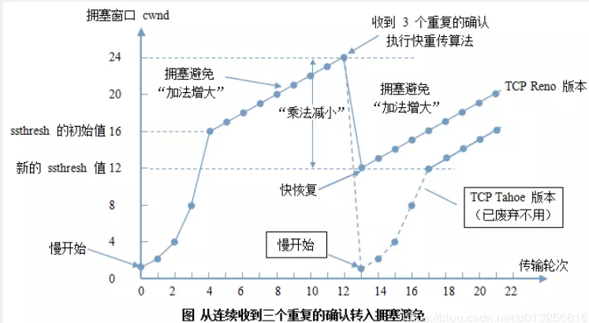

## TCP

#### TCP的特点

- TCP是面向连接的传输层协议。
- TCP连接是点对点的（套接字–IP:Port到套接字）。
- TCP提供可靠交付的服务。
- TCP提供全双工通信。
- 面向字节流。

### TCP与UDP的区别

|            | TCP          | UDP        |
| ---------- | ------------ | ---------- |
| 是否连接   | 面向连接     | 面向非连接 |
| 传输可靠性 | 可靠         | 不可靠     |
| 应用场合   | 传输大量数据 | 少量数据   |
| 速度       | 慢           | 快         |

### TCP报文结构


- **源端口、目的端口**：16位长。标识出远端和本地的端口号。

- 序列号（seq）

  ：32位长

  - 如果含有同步标识（SYN），则此为最初的序列号；第一个数据比特的序列码为本序列号加一
  - 如果没有同步标识（SYN），则此为第一个数据比特的序列码

- **确认号（ack）**：32位长。希望收到的下一个数据报的序列号，表明到序列号 `N-1` 为止的所有数据已经正确收到。

- TCP协议数据报头长：4位长。表明TCP头中包含多少个 4字节

- 保留：置0

- **ACK**：期望收到的数据的开始序列号。也即已经收到的数据的字节长度加1

- PSH：表示是带有PUSH标志的数据。接收方因此请求数据报一到便可送往应用程序而不必等到缓冲区装满时才传送。

- **RST**：用于复位由于主机崩溃或其它原因而出现的错误的连接。还可以用于拒绝非法的数据报或拒绝连接请求。

- **SYN**：用于建立连接。

- **FIN**：用于释放连接。

- **窗口大小（WIN）**：16位长。表示从确认号开始，本报文的发送方（数据发送端 or 数据接收端）可以接收的字节数，即接收窗口大小。用于流量控制。

- **校验和（Checksum）**：16位长。是为了确保高可靠性而设置的。它校验头部、数据和伪TCP头部之和。

- 紧急指针：`URG=1`时才有意义。

- 可选项：长度可变，最长40个字节。每个选项的开始是 1 字节的 kind 字段，说明选项的类型。

  - 0：选项表结束（1字节）
  - 1：无操作（1字节）用于选项字段之间的字边界对齐
  - 2：**MMS** 最大报文段长度，通常在创建连接而设置 SYN 标志的数据包中指明这个选项，指明本端所能接收的最大长度的报文段。通常将 MSS 设置为（MTU-40）字节，携带 TCP 报文段的 IP 数据报的长度就不会超过 MTU（MTU最大长度为1518字节，最短为64字节），从而避免本机发生IP分片。只能出现在同步报文段中，否则将被忽略。
  - 3：**窗口扩大因子（4字节，wscale）**，取值 0-14 。用来把 TCP 的窗口的值左移的位数，使窗口值乘倍。只能出现在同步报文段中，否则将被忽略。
  - 4：**sackOK** 发送端支持并同意使用SACK选项。
  - 5：**SACK** 选择确认选项
  - 8：时间戳 计算 RTT；用于处理TCP序号超过 2^32232 的情况，又称为防止序号回绕（PAWS）。
    - 发送端的时间戳（Timestamp）
    - 时间戳回显应答（Timestamp Echo）

> TCP最小长度为 20 个字节。


​	TCP就是有确认机制的UDP协议，每发出一个数据包都要求确认，如果有一个数据包丢失，就收不到确认，发送方就必须重发这个数据包。为了保证传输的可靠性，TCP协议在UDP基础之上建立了三次对话的确认机制，即在正式收发数据前，必须和对方建立可靠的连接。TCP数据包和UDP一样，都是由首部和数据两部分组成，唯一不同的是，TCP数据包没有长度限制，理论上可以无限长，但是为了保证网络的效率，通常TCP数据包的长度不会超过IP数据包的长度，以确保单个TCP数据包不必再分割。

### 三次握手

​	TCP是全双工通信协议 (通信的双方可以同时发送和接收信息的信息交互方式)。在数据通信开始之前先做好两端之间的准备工作。

​	所谓三次握手是指建立一个 TCP 连接时需要客户端和服务器端总共发送三个包以确认连接的建立。在socket编程中，这一过程由客户端执行connect来触发。

- 第一次握手：建立连接时，客户端发送 SYN 包（seq=j）到服务器，并进入`SYN_SENT`状态，等待服务器确认。
- 第二次握手：服务器收到 SYN 包，必须确认客户的 SYN（ack=j+1），同时自己也发送一个 SYN 包（seq=k），即 SYN + ACK 包，此时服务器进入 `SYN_RECV` 状态；
- 第三次握手：客户端收到服务器的 SYN+ACK 包，向服务器发送确认包 ACK（ack=k+1），此包发送完毕，客户端和服务器进入`ESTABLISHED`（TCP连接成功）状态，完成三次握手。

**为了需要三次握手才能建立起连接？**

 	为了初始化 Sequence Number 的初始值。通信的双方，需要互相通知给对方知道自己的 Sequence Number的初始值，也就是上图的 x 和 y，用来作为以后数据通信的序号，保证应用层接收到的数据不会因为网络的传输问题而乱序。即 TCP 会用这个序号来拼接数据，因此在第二次握手之后，客户端还需要发送确认报文给服务器，告知服务器：客户端已收到你的发送的 Sequence Number 。


可能出现的问题：

​	1.在客户端发送SYN后，如果服务端一直不回应SYN+ACK报文，客户端会不断的重传SYN报文直到超过一定的重传次数或超时时间。

​	2.在客户端发送SYN后，服务端回应SYN+ACK报文，但客户端不再回复ACK，服务端也会一直重传直到超过一定的重传次数或超时时间。linux 默认等待63秒才断开连接 (可能会导致服务器遭到SYN报文攻击，攻击者从而耗尽 SYN 的连接队列，让正常请求的连接无法处理) 

​	**syn flood攻击**

​    当开放了一个TCP端口后，该端口就处于Listening状态，不停地监视发到该端口的Syn报文，一 旦接收到Client发来的Syn报文，就需要为该请求分配一个TCB，通常一个TCB至少需要280个字节，在某些操作系统中TCB甚至需要1300个字节，并返回一个SYN ACK命令，立即转为SYN-RECEIVED即半开连接状态。

​    如果恶意的向某个服务器端口发送大量的SYN包，则可以使服务器打开大量的半开连接，分配TCB（Transmission Control Block）, 从而消耗大量的服务器资源，同时也使得正常的连接请求无法被相应。

​    常见的防攻击方法有：

​    1.**无效连接的监视释放**

​      监视系统的半开连接和不活动连接，当达到一定阈值时拆除这些连接，从而释放系统资源。这种方法对于所有的连接一视同仁，而且由于SYN Flood造成的半开连接数量很大，正常连接请求也被淹没在其中被这种方式误释放掉，因此这种方法属于入门级的SYN Flood方法。

​    2.**延缓TCB分配方法**

​      消耗服务器资源主要是因为当SYN数据报文一到达，系统立即分配TCB，从而占用了资源。而SYN Flood由于很难建立起正常连接，因此，当正常连接建立起来后再分配TCB则可以有效地减轻服务器资源的消耗。常见的方法是使用Syn Cache和Syn Cookie技术。

​    **2.1Syn Cache技术**

​      系统在收到一个SYN报文时，在一个专用HASH表中保存这种半连接信息，直到收到正确的回应ACK报文再分配TCB。这个开销远小于TCB的开销。当然还需要保存序列号。

​    **2.2Syn Cookie技术**

​      Syn Cookie技术则完全不使用任何存储资源，这种方法比较巧妙，它使用一种特殊的算法生成Sequence Number，这种算法考虑到了对方的IP、端口、己方IP、端口的固定信息，以及对方无法知道而己方比较固定的一些信息，如MSS(Maximum Segment Size，最大报文段大小，指的是TCP报文的最大数据报长度，其中不包括TCP首部长度.)、时间等，在收到对方 的ACK报文后，重新计算一遍，看其是否与对方回应报文中的（Sequence Number-1）相同，从而决定是否分配TCB资源。


  **如果已经建立了连接，但是客户端突然出现故障了怎么办？**

  保活机制:若在一段时间内，连接处于非活动状态，则向对方发送保活探测报文，如果发送端未收到响应报文，则在下一个保活时间点，再次尝试发送保活探测报文。若尝试次数达到保活探测数，仍未收到响应报文，则断开连接。

  TCP设有一个保活计时器，显然，客户端如果出现故障，服务器不能一直等下去，白白浪费资源。服务器每收到一次客户端的请求后都会重新复位这个计时器，时间通常是设置为2小时，若两小时还没有收到客户端的任何数据，服务器就会发送一个探测报文段，以后每隔75秒钟发送一次。若一连发送10个探测报文仍然没反应，服务器就认为客户端出了故障，接着就关闭连接。

   

  **为什么不能用两次握手进行连接？**

  3次握手完成两个重要的功能，既要双方做好发送数据的准备工作(双方都知道彼此已准备好)，也要允许双方就初始序列号进行协商，这个序列号在握手过程中被发送和确认。

  现在把三次握手改成仅需要两次握手，死锁是可能发生的。作为例子，考虑计算机S和C之间的通信，假定C给S发送一个连接请求分组，S收到了这个分组，并发送了确认应答分组。按照两次握手的协定，S认为连接已经成功地建立了，可以开始发送数据分组。

  可是，C在S的应答分组在传输中被丢失的情况下(即服务端发送给客户端的ACK丢失)，将不知道S 是否已准备好，不知道S建立什么样的序列号，C甚至怀疑S是否收到自己的连接请求分组。在这种情况下，C认为连接还未建立成功，将忽略S发来的任何数据分组，只等待连接确认应答分组。而S在发出的分组超时后，重复发送同样的分组。这样就形成了死锁。


### 内核对 TCP 的处理

​	Socket 是一个由 （源IP、源Port、目标IP、目标Port、协议） 组成的五元组，唯一标示一个 socket 连接。

​	TCP 建立连接的整体流程：

1. 服务器端在调用 `listen` 之后，内核会建立两个队列，`SYN`队列和`ACCEPT`队列，其中`ACCPET`队列的长度由`backlog`指定。
2. 服务器端在调用 `accpet` 之后，将阻塞，等待 `ACCPT` 队列有元素。
3. 客户端在调用 `connect` 之后，将开始发起 `SYN` 请求，请求与服务器建立连接，此时称为第一次握手。
4. 服务器端在接受到 `SYN` 请求之后，把请求方放入 `SYN` 队列中，并给客户端回复一个确认帧 `ACK` ，此帧还会携带一个请求与客户端建立连接的请求标志，也就是 `SYN` ，这称为第二次握手
5. 客户端收到 `SYN+ACK` 帧后， `connect` 返回，并发送确认建立连接帧 `ACK` 给服务器端。这称为第三次握手
6. 服务器端收到 `ACK` 帧后，会把请求方从 `SYN` 队列中移出，放至 `ACCEPT` 队列中，而 `accept` 函数也等到了自己的资源，从阻塞中唤醒，从 `ACCEPT` 队列中取出请求方，重新建立一个新的 `sockfd` ，并返回。

在服务端如何分发多个连接的请求？

​	由于 `TCP/IP` 协议栈是维护着一个接收和发送缓冲区的。在接收到来自客户端的数据包后，服务器端的 `TCP/IP` 协议栈应该会做如下处理：

1. 如果收到的是请求连接的数据包，则传给监听着连接请求端口的 `socetfd` 套接字。
2. 如果是已经建立过连接后的客户端数据包，则将数据放入接收缓冲区。这样，当服务器端需要读取指定客户端的数据时，则可以利用 `socketfd_new` 套接字通过 `recv` 或者 `read` 函数到缓冲区里面去取指定的数据（因为 `socketfd_new` 代表的 `socket` 对象记录了客户端IP和端口，因此可以鉴别）。

数据包如何找到相对应的 socket ，这个方法在 Linux Kernel 代码里也是有体现的：

```
static inline struct sock *__inet_lookup(struct net *net,
                     struct inet_hashinfo *hashinfo,
                     const __be32 saddr, const __be16 sport,
                     const __be32 daddr, const __be16 dport,
                     const int dif)
{
    u16 hnum = ntohs(dport);
    /* 先尝试查找处于连接成功的 socket */
    struct sock *sk = __inet_lookup_established(net, hashinfo,
                saddr, sport, daddr, hnum, dif);
     /* 如果没有找到连接成功的socket，那么就去处于 listen 状态的 socket 查找 */
    return sk ? : __inet_lookup_listener(net, hashinfo, daddr, hnum, dif);
}
```


### 四次挥手


> 在Time_Wait阶段，主动端等待2*MSL时间，MSL建议为2分钟。

​	由于TCP连接是全双工的，因此每个方向都必须单独进行关闭。

- 客户端A发送一个FIN，用来关闭客户A到服务器B的数据传送（报文段4）。
- 服务器B收到这个FIN，它发回一个ACK，确认序号为收到的序号加1（报文段5）。和SYN一样，一个FIN将占用一个序号。
- 服务器B关闭与客户端A的连接，发送一个FIN给客户端A（报文段6）。
- 客户端A发回ACK报文确认，并将确认序号设置为收到序号加1（报文段7）


**问题1**.为什么连接的时候是三次握手，关闭的时候却是四次握手？

  答：因为当Server端收到Client端的SYN连接请求报文后，可以直接发送SYN+ACK报文。其中ACK报文是用来应答的，SYN报文是用来同步的。

​	但是关闭连接时，当Server端收到FIN报文时，很可能并不会立即关闭SOCKET，所以只能先回复一个ACK报文，告诉Client端，"你发的FIN报文我收到了"。只有等到我Server端所有的报文都发送完了，我才能发送FIN报文，因此不能一起发送。故需要四步握手。

**问题2**.为什么TIME_WAIT状态需要经过2MSL(最大报文段生存时间)才能返回到CLOSE状态？

答：虽然按道理，四个报文都发送完毕，我们可以直接进入CLOSE状态了，但是我们必须假象网络是不可靠的，有可以最后一个ACK丢失。所以TIME_WAIT状态就是用来重发可能丢失的ACK报文。在Client发送出最后的ACK回复，但该ACK可能丢失。

​	Server如果没有收到ACK，将不断重复发送FIN片段。所以Client不能立即关闭，它必须确认Server接收到了该ACK。

​	Client会在发送出ACK之后进入到TIME_WAIT状态。Client会设置一个计时器，等待2MSL的时间。如果在该时间内再次收到FIN，那么Client会重发ACK并再次等待2MSL。所谓的2MSL是两倍的MSL(Maximum Segment Lifetime)。MSL指一个片段在网络中最大的存活时间，2MSL就是一个发送和一个回复所需的最大时间。如果直到2MSL，Client都没有再次收到FIN，那么Client推断ACK已经被成功接收，则结束TCP连接。

**问题3**.四次挥手中，服务端出现大量的 CLOSE_WAIT 状态，可能的原因？

​	答：服务端出现大量的 CLOSE_WAIT 状态，可能的原因是：客户端发送 第一次FIN报文之后，服务端没有发送给客户端 第二次的 ACK 报文，或者是 服务端没有发送 第三次的 FIN 报文。

​	可以理解为：客户端关闭socket连接，而服务端忙于读或者写操作，没有及时响应去关闭连接。

​	可能需要检查代码，特别是释放资源的代码。

​	检查处理请求的线程配置是否合理。


### 数据传输

#### 可靠传输

​	通常在每个 TCP 报文段中都有一对序号和确认号。TCP报文发送者称自己的字节流的编号为 **序号** （sequence number），称接收到对方的字节流编号为 **确认号** 。TCP 报文的接收者为了确保可靠性，在接收到一定数量的连续字节流后才发送确认。这是对 TCP 的一种扩展，称为选择确认（Selective Acknowledgement）。选择确认使得 TCP 接收者可以对乱序到达的数据块进行确认。**每一个字节传输过后，SN号都会递增1**。

​	通过使用序号和确认号，TCP 层可以把收到的报文段中的字节按正确的顺序交付给应用层。序号是 32 位的无符号数，在它增大到 2^{32}-1232−1 时，便会回绕到 0。对于初始化序列号(ISN)的选择是 TCP 中关键的一个操作，它可以确保强壮性和安全性。

​	TCP 协议使用序号标识每端发出的字节的顺序，从而另一端接收数据时可以重建顺序，无惧传输时的包的乱序交付或丢包。在发送第一个包时（SYN包），选择一个 **随机数** 作为序号的初值，以克制 TCP 序号预测攻击。

​	发送确认包（Acks），携带了接收到的对方发来的字节流的编号，称为确认号，以告诉对方 **已经成功接收的数据流的字节位置**。Ack并不意味着数据已经交付了上层应用程序。可靠性通过发送方检测到丢失的传输数据并重传这些数据。包括 **超时重传**（Retransmission timeout，RTO）与 **重复累计确认** （duplicate cumulative acknowledgements，DupAcks）。

#### 重复累计确认重传

​	如果一个包（不妨设它的序号是 100 ，即该包始于第 100 字节）丢失，接收方就不能确认这个包及其以后的包，因为采用了 **累计ACK** 。接收方在收到 100 以后的包时，发出对包含第 99 字节的包的确认。这种重复确认是包丢失的信号。**发送方如果收到 3 次对同一个包的确认，就重传最后一个未被确认的包**。阈值设为 3 被证实可以减少乱序包导致的无作用的重传（spurious retransmission）现象。**选择性确认（SACK）**的使用能明确反馈哪个包收到了，极大改善了TCP重传必要的包的能力。

#### 超时重传

​	发送方使用一个保守估计的时间作为收到数据包的确认的超时上限。如果超过这个上限仍未收到确认包，发送方将重传这个数据包。每当发送方收到确认包后，会重置这个重传定时器。典型地，定时器的值设定为 {\text{smoothed RTT}}+\max(G,4\times {\text{RTT variation}})smoothed RTT+max(*G*,4×RTT variation) 其中 G*G* 是时钟粒度。进一步，如果重传定时器被触发，仍然没有收到确认包，定时器的值将被设为前次值的二倍（直到特定阈值）。这可对抗 中间人攻击方式的拒绝服务攻击，这种攻击愚弄发送者重传很多次导致接受者被压垮。

###### 数据传输举例


1. 发送方首先发送第一个包含序列号为1（可变化）和 1460 字节数据的 TCP 报文段给接收方。接收方以一个没有数据的 TCP 报文段来回复（只含报头），用确认号 1461 来表示已完全收到并请求下一个报文段。
2. 发送方然后发送第二个包含序列号为 1461 ，长度为 1460 字节的数据的 TCP 报文段给接收方。正常情况下，接收方以一个没有数据的 TCP 报文段来回复，用确认号 2921（1461+1460）来表示已完全收到并请求下一个报文段。发送接收这样继续下去。
3. **然而当这些数据包都是相连的情况下，接收方没有必要每一次都回应**。比如，他收到第 1 到 5 条TCP报文段，只需回应第五条就行了。在例子中第3条TCP报文段被丢失了，所以尽管他收到了第 4 和 5 条，然而他只能回应第 2 条。
4. 发送方在发送了第三条以后，没能收到回应，因此当时钟（timer）过时（expire）时，他重发第三条。（每次发送者发送一条TCP报文段后，都会再次启动一次时钟：RTT）。
5. 这次第三条被成功接收，接收方可以直接确认第5条，因为4，5两条已收到。


### 流量控制

​	流量控制用来避免主机分组发送得过快而使接收方来不及完全收下，一般由接收方通告给发送方进行调控，这里的窗口被称为 **接收通知窗口（Receiver's Advertised Window）**。

​	流量控制通过 **滑动窗口机制** 来实现： **报文发送方** 在 **WIN** 域指出还可接收的字节数量（rwnd）。报文接收方在没有新的确认包的情况下至多发送 WIN 允许的字节数量。在数据传输过程中，报文发送方可修改 WIN 的值。

> 报文发送方：即可以是握手的发起方（客户端），也可以是握手的被动接收方（服务端）


1. 报文段 2 中提供的窗口大小为 6144 字节；
2. 由于这是一个较大的窗口，因此发送端立即连续发送了6个报文段（4~9），停止；
3. 报文段 10 确认了所有的数据（从第 1 到 6144 字节），但提供的窗口大小却为 2048，这很可能是接收程序不能读取多于 2048 字节的数据；
4. 报文段 11 和 12 完成了客户的数据传输，且最后一个报文段带有 FIN 标志；
5. 报文段 13 包含与报文段 10 相同的确认序号，但通告了一个更大的窗口大小；
6. 报文段 14 确认了最后的 2048 字节的数据和 FIN ；
7. 报文段 15 和 16 仅用于通告一个更大的窗口大小；
8. 报文段 17 和 18 完成通常的关闭过程；

当接收方宣布接收窗口的值为 0，发送方停止进一步发送数据，开始了 **保持定时器（persist timer）**，以 **避免因随后的修改接收窗口的数据包丢失使连接的双侧进入死锁** ，发送方无法发出数据直至收到接收方修改窗口的指示。当定时器到期时， TCP 发送方尝试恢复发送一个小的 **ZWP 包（Zero Window Probe）**，期待接收方回复一个带着新的接收窗口大小的确认包。一般 ZWP 包会设置成 3 次，如果 3 次过后还是 0 的话，有的 TCP 实现就会发 RST 把链接断了。

#### 拥塞控制

TCP 拥塞控制算法是互联网上主要的拥塞控制措施，它使用一套基于 **线増积减**（Additive increase/multiplicative decrease，AIMD）的网络拥塞控制方法来控制拥塞，**防止过多的数据注入到网络中，这样可以使网络中的路由器或链路不致过载**。

除了 **拥塞窗口大小（cwnd）** 之外，TCP 连接的双方都有 **接收窗口大小（rwnd）**。客户端能够同时传输的最大数据段的数量是接收窗口大小和拥塞窗口大小的最小值，即 min(rwnd, cwnd)*m**i**n*(*r**w**n**d*,*c**w**n**d*) 。

TCP 协议使用慢启动阈值（Slow start threshold, ssthresh）来决定使用慢启动或者拥塞避免算法：

- 当拥塞窗口大小小于慢启动阈值时，使用慢启动；
- 当拥塞窗口大小大于慢启动阈值时，使用拥塞避免算法；
- 当拥塞窗口大小等于慢启动阈值时，使用慢启动或者拥塞避免算法；

#### 慢开始和拥塞避免

客户端维持一个 **拥塞窗口 `cwnd`** 的状态变量，初始值一般为 2\times MSS2×*M**S**S* 。


- `慢开始`：**由小到大的指数增大拥塞窗口**。首先将 cwnd 设置为一个最大报文段 MMS ，在收到一个对新的报文段的确认后，把拥塞窗口增加一个 MMS 。
- `拥塞避免`：当慢开始到阈值（ssthresh）后，使用拥塞避免算法（ cwnd 每次加1 ）。当发送方发送的数据包丢包时，将 ssthresh 置为 cwnd 的一半，将 cwnd 置为1，再次执行慢开始。

#### 快重传和快恢复

​	**快速重传和恢复（fast retransmit and recovery，FRR）** 是一种拥塞控制算法，它能快速恢复丢失的数据包。没有 FRR，如果数据包丢失了，TCP 将会使用定时器来要求传输暂停。在暂停的这段时间内，没有新的或复制的数据包被发送。有了FRR，如果接收机接收到一个不按顺序的数据段，它会立即给客户端发送一个重复确认。如果客户端接收到三个重复确认，它会认定数据段丢失，并立即重传这些丢失的数据段。

​	有了 FRR，就不会因为重传时要求的暂停被耽误。当有单独的数据包丢失时，快速重传和恢复（FRR）能最有效地工作。当有多个数据信息包在某一段很短的时间内丢失时，它则不能很有效地工作。

#### BBR

​	BBR（Bottleneck Bandwidth and Round-trip propagation time）是 Google 研发的新的拥塞控制算法。自从 20 世纪 80年代后， TCP 中的拥塞控制算法都使用的是 **基于丢包的拥塞控制**（拥塞避免），在之前的网络带宽、路由器 Buffer 的情况下，该算法效果良好。

​	但是在当前的网络条件下，基于丢包的拥塞控制算法则会导致 TCP 性能问题：

- 在小 Buffer 路由器环境下，丢包发生在拥塞之前。在高速，长途链路中，基于丢包的拥塞控制会导致吞吐量过低，因为它反应过度，即使丢包是由瞬时流量突发引起的，也会因丢包而将发送速率减半（即使链路大部分处于空闲状态，这种丢包也可能非常频繁）
- 在大 Buffer 路由器环境下，拥塞发生在丢包之前。在互联网的边缘，基于丢包的拥塞控制通过反复填充大量的缓存，从而导致了臭名昭著的 **bufferbloat** 问题。

> bufferbloat 问题：由于路由器的大缓存，减少链路丢包。再加上网络中 TCP 大量使用基于丢包的拥塞控制算法（丢包才触发速度下调，但是要丢包，缓存就得先被填满，缓存都填满，延迟更高）

BBR 算法使用最大带宽和往返时间来建立网络的显式模型。每次对包传递进行累积或选择性确认，都会生成一个速率样本，该速率采样记录在数据包传输与该包确认之间的时间间隔内传递的数据量，从而使拥塞控制算法能够提供更高的吞吐量和更低的延迟。

#### 最大分段大小

​	**最大分段大小 (MSS)** 是在单个分段中 TCP 愿意接受的数据的字节数最大值。MSS应当足够小以避免IP分片，它会导致丢包或过多的重传。

​	**在 TCP 连接创建时，双端在 SYN 报文中用 MSS 选项宣布各自的 MSS ，这是从双端各自直接相连的数据链路层的最大传输单元(MTU)的尺寸减去固定的 IP 首部和 TCP 首部长度**。以太网MTU为 1500 字节， MSS值可达 1460 字节。使用 IEEE 802.3 的 MTU 为 1492 字节，MSS 可达 1452 字节。

​	如果目的IP地址为“非本地的”，MSS通常的默认值为 536（这个默认值允许 20 字节的 IP 首部和 20 字节的 TCP 首部以适合 576字节 IP 数据报）。此外，发送方可用传输路径 MTU 发现（RFC 1191）推导出从发送方到接收方的网络路径上的最小 MTU，以此动态调整 MSS 以避免网络 IP 分片。

​	MSS 发布也被称作“MSS协商”（MSS negotiation）。严格讲，这并非是协商出来一个统一的MSS值，TCP 允许连接两端使用各自不同的MSS值。例如，这会发生在参与 TCP 连接的一台设备使用非常少的内存处理到来的 TCP 分组。

#### 选择确认

​	**最初采取累计确认的 TCP 协议在丢包时效率很低**。例如，假设通过10个分组发出了1万个字节的数据。如果第一个分组丢失，在纯粹的累计确认协议下，接收方不能说它成功收到了 1,000 到 9,999 字节，但未收到包含 0 到 999 字节的第一个分组。因而，发送方可能必须重传所有1万个字节。

​	为此，TCP采取了 **选择确认（selective acknowledgment，SACK）** 选项。RFC 2018 对此定义为 **允许接收方确认它成功收到的分组的不连续的块**，以及基础 TCP 确认的成功收到最后连续字节序号。这种确认可以指出 SACK block，包含了已经成功收到的连续范围的开始与结束字节序号。在上述例子中，接收方可以发出 SACK 指出序号 1000 到 9999 ，发送方因此知道只需重发第一个分组(字节 0 到 999)。

​	TCP 发送方会把乱序收包当作丢包，因此会重传乱序收到的包，导致连接的性能下降。重复SACK选项（duplicate-SACK option）是定义在RFC 2883中的SACK的一项扩展，可解决这一问题。接收方发出 D-SACK 指出没有丢包，接收方恢复到高传输率。 D-SACK 使用了 SACK 的第一个段来做标志：

- 如果 SACK 的第一个段的范围被 ACK 所覆盖，那么就是 D-SACK;
- 如果 SACK 的第一个段的范围被 SACK 的第二个段覆盖，那么就是 D-SACK

> D-SACK旨在告诉发送端：收到了重复的数据，数据包没有丢，丢的是ACK包；

​	SACK 选项并不是强制的。仅当双端都支持时才会被使用。 TCP 连接创建时会在 TCP 头中协商 SACK 细节。在 Linux下，可以通过 `tcp_sack` 参数打开 SACK 功能（Linux 2.4后默认打开）。Linux下的 `tcp_dsack` 参数用于开启D-SACK功能（Linux 2.4后默认打开）。选择确认也用于流控制传输协议 (SCTP)。


TCP通过下列方式来提供可靠性：

-   应用数据被**分割**成TCP认为最适合发送的数据块。这和UDP完全不同，应用程序产生的数据长度将保持不变。由TCP传递给IP的信息单位称为报文段或段（segment）。
-   当TCP发出一个段后，它启动一个**定时器**，等待目的端确认收到这个报文段。如果不能及时收到一个确认，将重发这个报文段。当TCP收到发自TCP连接另一端的数据，它将发送一个确认。TCP有延迟确认的功能，在此功能没有打开，则是立即确认。功能打开，则由定时器触发确认时间点。
-   TCP将保持它首部和数据的**检验和**。这是一个端到端的检验和，目的是检测数据在传输过程中的任何变化。如果收到段的检验和有差错，TCP将丢弃这个报文段和不确认收到此报文段（希望发端超时并重发）。
-   既然TCP报文段作为IP数据报来传输，而IP数据报的到达可能会失序，因此TCP报文段的到达也可能会失序。如果必要，TCP将对收到的数据进行**重新排序**，将收到的数据以正确的顺序交给应用层。
-   既然IP数据报会发生重复，TCP的接收端必须**丢弃重复的数据**。
-   TCP还能提供**流量控制**。TCP连接的每一方都有固定大小的缓冲空间。TCP的接收端只允许另一端发送接收端缓冲区所能接纳的数据。这将防止较快主机致使较慢主机的缓冲区溢出。

 


## **差错控制**

  TCP使用差错控制来提供可靠性。差错控制包括以下的一些机制：检测和重传受到损伤的报文段、重传丢失的报文段、保存失序到达的报文段直至缺失的报文到期，以及检测和丢弃重复的报文段。

  TCP通过三个简单的工具来完成其差错控制：**检验和**、**确认**以及**超时**。

 


## **通过序列号与确认应答提高可靠性**

- 在 TCP 中，当发送端的数据到达接收主机时，接收端主机会返回一个已收到消息的通知。这个消息叫做确认应答（ACK）。当发送端将数据发出之后会等待对端的确认应答。如果有确认应答，说明数据已经成功到达对端。**反之，则数据丢失的可能性很大**。
- 在一定时间内没有等待到确认应答，发送端就可以认为数据已经丢失，并进行重发。由此，即使产生了丢包，仍然能够保证数据能够到达对端，实现可靠传输。
- 未收到确认应答并不意味着数据一定丢失。也有可能是数据对方已经收到，只是返回的确认应答在途中丢失。这种情况也会导致发送端误以为数据没有到达目的地而重发数据。
- 此外，也有可能因为一些其他原因导致确认应答延迟到达，在源主机重发数据以后才到达的情况也屡见不鲜。此时，源主机只要按照机制重发数据即可。
- 对于目标主机来说，反复收到相同的数据是不可取的。为了对上层应用提供可靠的传输，目标主机必须放弃重复的数据包。为此我们引入了序列号。

 


## **重传策略**

  TCP协议用于控制数据段是否需要重传的依据是设立重发定时器。在发送一个数据段的同时启动一个重传，如果在重传超时前收到确认（Acknowlegement）就关闭该重传，如果重传超时前没有收到确认，则重传该数据段。在选择重发时间的过程中，TCP必须具有自适应性。它需要根据互联网当时的通信情况，给出合适的重发时间。

  这种重传策略的关键是对定时器初值的设定。采用较多的算法是Jacobson于1988年提出的一种不断调整超时时间间隔的动态算法。其工作原理是：

  对每条连接TCP都保持一个变量RTT（Round Trip Time），用于存放当前到目的端往返所需要时间最接近的估计值。当发送一个数据段时，同时启动连接的定时器，如果在定时器超时前确认到达，则记录所需要的时间（M），并修正RTT的值，如果定时器超时前没有收到确认，则将RTT的值增加1倍。通过测量一系列的RTT（往返时间）值，TCP协议可以估算数据包重发前需要等待的时间。在估计该连接所需的当前延迟时通常利用一些统计学的原理和算法（如Karn算法），从而得到TCP重发之前需要等待的时间值。

 


## **重传时间间隔的确定**

- **RTT**:发送一个数据包到收到对应的ACK，所花费的时间。
- **RTO**:重传时间间隔。**重发超时是指在重发数据之前，等待确认应答到来的那个特定时间间隔。**如果超过这个时间仍未收到确认应答，发送端将进行数据重发。最理想的是，找到一个最小时间，它能保证“确认应答一定能在这个时间内返回”。
- TCP 要求不论处在何种网络环境下都要提供高性能通信，并且无论网络拥堵情况发生何种变化，都必须保持这一特性。为此，它在每次发包时都会计算往返时间 **RTT** 及其偏差。将这个往返时间 **RTT** 和偏差时间相加，重传时间间隔 **RTO** 就是比这个总和要稍大一点的值。
- 数据被重发之后若还是收不到确认应答，则进行再次发送。此时，等待确认应答的时间将会以2倍、4倍的指数函数延长。
- 数据也不会被持续不断地反复重发。达到一定重发次数之后，如果仍没有任何确认应答返回，就会判断为网络或对端主机发生了异常，强制关闭连接。并且通知应用通信异常强行终止。

 


## **以段为单位发送数据**

- 在建立 TCP 连接的同时，也可以确定发送数据包的单位，我们也可以称其为“消息长度”（MSS）。最理想的情况是，消息长度正好是 IP 中不会被分片处理的数据长度。
- TCP 在传送大量数据时，是以 MSS 的大小将数据进行分割发送。进行重发时也是以 MSS 为单位。
- MSS 在三次握手的时候，在两端主机之间被计算得出。两端的主机在发出建立连接的请求时，会在 TCP 首部中写入 MSS 选项，告诉对方自己的接口能够适应的 MSS 的大小。然后会在两者之间选择一个较小的值投入使用。

 


## **利用窗口控制提高速度**

- TCP 以1个段为单位，若每发送一个段进行一次确认应答的处理，则包的往返时间越长通信性能就越低。
- 为解决这个问题，TCP 引入了窗口这个概念：确认应答不再是以每个分段，而是以更大的单位进行确认，转发时间将会被大幅地缩短。也就是说，发送端主机，在发送了一个段以后不必要一直等待确认应答，而是可以继续发送。

   

  窗口大小就是指无需等待确认应答而可以继续发送数据的值。上图中窗口大小为4个段。这个机制实现了使用大量的缓冲区，通过对多个段同时进行确认应答的功能。由于发送方不必每发一个分组就停下来等待确认，因此可以加速数据的传输。

 


## **滑动窗口控制**

  TCP使用滑动窗口做流量控制与重传：

​    保证TCP的可靠性(确保数据包均已成功发送)

​    保证TCP的**流量控制**特性(通过动态改变窗口大小来调节两台主机间的数据传输，确保接收端的接收速度能够和发送端的发送速度相匹配)

>  

  cwnd：发送端窗口(congestion window)

  发送方的发送缓存内的数据都可以被分为4类:

  \1. 已发送，已收到ACK  2. 已发送，未收到ACK  3. 未发送，但允许发送  4. 未发送，但不允许发送

  

  其中类型2和3都属于发送窗口

>  

  rwnd：接收端窗口(receiver window)

  接收方的缓存数据分为3类：

1. 已接收  2. 未接收但准备接收  3. 未接收而且不准备接收

  

  其中类型2属于接收窗口

 


### **滑动机制**

​    发送窗口只有收到发送窗口内字节的ACK确认，才会移动发送窗口的左边界。接收到的确认号：下一个所期待的字节。

​    接收窗口只有在前面所有的段都确认的情况下才会移动左边界。当在前面还有字节未接收但收到后面字节的情况下，窗口不会移动，并不对后续字节确认。只要当确认字节之前的所有数据都已到达之后才会发送确认，这种方式被称为 **累计确认**。如：接收端可以已获得：0、1、2、4、5、6、7，它会先确认段2(含段2)之前的数据，当发送端超时，会重发段3.因为接收端已缓存了段4到段7，一旦它收到段3，那么可立即确认直到段7的全部字节。


  第一次发送数据这个时候的窗口大小是根据链路带宽的大小来决定的。

  假设这个时候窗口的大小是3。这个时候接受方收到数据以后会对数据进行确认告诉发送方我下次希望手到的是数据是多少。这里我们看到接收方发送的ACK=3(这是发送方发送序列2的回答确认，下一次接收方期望接收到的是3序列信号)。

  这个时候发送方收到这个数据以后就知道我第一次发送的3个数据对方只收到了2个。就知道第3个数据对方没有收到。下次在发送的时候就从第3个数据开始发。

 


### 流量控制

  端到端，接收端的应用层处理速度决定和网速无关，由接收端返回的 rwnd 控制。

  通过动态改变窗口大小来调节两台主机间的数据传输，确保接收端的接收速度能够和发送端的发送速度相匹配

- 当rwnd < cwnd 时，是接收方的接收能力限制发送方窗口的最大值。
- 当cwnd < rwnd 时，则是网络的拥塞限制发送方窗口的最大值。
- 发送方窗口的上限值 cwnd = Min [ rwnd, cwnd ]

 


## **拥塞控制**

  防止过多的数据注入到网络当中，这样可以使网络中的路由器或链路不致过载。

  拥塞控制由发送端 cwnd 主动控制，有几种拥塞控制方法：

> - **慢启动：**从cwnd初始为1开始启动，指数增长
> - **拥塞避免：**cwnd 到达 ssthresh 后，为了避免拥塞开始尝试 线性增长
> - **快重传：**接收方每收到一个报文段都要回复一个当前最大连续位置的确认，当后面的序号先到达，如接收方接收到了1、 3、 4，而2没有收到，就会立即向发送方重复发送三次ACK=2的确认请求重传。发送方连续收到3个相同序号的ACK，就重传该数据包，而不用等待超时
> - **快恢复：**ssthresh 减半，cwnd 直接从ssthresh线性增长

  如果网络上的延时突然增加，那么TCP对此的应对只能是重传数据，但重传会导致网络的负担更重，于是会导致更大的延迟以及更多的丢包。

  TCP的设计理念：当拥塞发生的时候，要做自我牺牲。就像交通阻塞一样，每个车都应该把路让出来，而不要再去抢路了。


### **慢启动**

  当主机开始发送数据时，如果立即将大量数据字节注入到网络，那么就有可能因为不清楚当前网络的负荷情况而引起网络阻塞。所以，最好的方法是先探测一下，即由小到大逐渐增大发送窗口，也就是说，由小到大逐渐增大拥塞窗口数值。通常在刚刚发送报文段时，先把拥塞窗口cwnd设置为一个最大报文段MSS的数值。而在每收到一个新的报文段的确认后，把拥塞窗口增加至多一个MSS的数值。用这样的方法逐步增大发送方的拥塞窗口cwnd，可以使分组注入到网络的速率更加合理。

  只有在TCP连接建立和网络出现超时时才使用。每经过一个传输轮次，cwnd 就加倍。一个传输轮次所经历的时间其实就是往返时间 RTT。慢开始的“慢”并不是指cwnd的增长速率慢，而是指在TCP开始发送报文段时先设置 cwnd = 1，使得发送方在开始时只发送一个报文段(目的是试探一下网络的拥塞情况)，然后再逐渐增大cwnd。

  为了防止拥塞窗口 cwnd 增长过大引起网络拥塞，还需要设置一个慢开始门限 ssthresh 状态变量。慢开始门限 ssthresh 的用法如下：
    当 cwnd < ssthresh 时，使用 慢开始算法。
    当 cwnd > ssthresh 时，停止使用 慢开始算法 而改用 拥塞避免算法。
    当 cwnd = ssthresh 时，既可使用 慢开始算法，也可使用 拥塞控制避免算法。


### **拥塞避免**：

  让拥塞窗口cwnd缓慢地增大，即每经过一个往返时间RTT就把发送方的拥塞窗口cwnd加1，而不是加倍。这样拥塞窗口cwnd按线性规律缓慢增长，比慢开始算法的拥塞窗口增长速率缓慢得多。

  无论在慢开始阶段还是在拥塞避免阶段，只要发送方判断网络出现拥塞（其根据就是没有收到确认），就要把慢开始门限ssthresh设置为出现拥塞时的发送方窗口值的一半（但不能小于2）。然后把拥塞窗口cwnd重新设置为1，执行慢开始算法。这样做的目的就是要迅速减少主机发送到网络中的分组数，使得发生拥塞的路由器有足够时间把队列中积压的分组处理完毕。

  执行过程：

  1）当TCP连接进行初始化时，把拥塞窗口cwnd置为1。

  2）在执行慢开始算法时，拥塞窗口cwnd随着传输轮次按指数规律增长。当拥塞窗口cwnd增长到慢开始门限值ssthresh时（即当cwnd=16时），就改为执行拥塞控制算法，拥塞窗口按线性规律增长。

  3）当网络发生拥塞，把ssthresh值更新为拥塞前ssthresh值的一半，cwnd重新设置为1，再按照2执行。

  如：

  a.在TCP连接进行初始化的时候，cwnd = 1，ssthresh = 16;

  b.在慢启动算法开始时，cwnd的初始值是1，每次发送方收到一个ACK拥塞窗口就增加1，当ssthresh == cwnd时，启动拥塞控制算法，拥塞窗口按照线性规律增长；

  c.当cwnd = 24时，网络出现超时，发送方收不到确认ACK，此时设置ssthresh = 12,设置cwnd = 1,然后开始慢启动算法，当cwnd = ssthresh=12，慢启动算法变为拥塞控制算法，cwnd按照线性速度增长


  AIMD（加法增大乘法减小）

  a.乘法减小：无论在慢启动阶段还是在拥塞控制阶段，只要网络出现超时，就是将cwnd置为1，sthresh置为cwnd的一半，然后开始执行慢启动算法

  b.加法增大：当网络频发出现超时情况时，ssthresh就下降的很快，为了减少注入到网络当中的分组数，而加法增大是执行拥塞避免算法后，是拥塞窗口缓慢的增大，以防止网络过早出现拥塞。

  这两个结合起来就是AIMD算法，是使用最广泛的算法。拥塞避免算法不能够完全避免网络y拥塞，通过控制拥塞窗口的大小只能使网络不易出现拥塞。


### 快重传

  如果发送方设置的超时计时器时限已到但还未收到确认，那么很可能是网络出现了拥塞，致使报文段在网络中的某处被丢弃。

  慢开始和拥塞避免的处理：TCP马上把拥塞窗口 cwnd 减小到1，并执行慢开始算法，同时把慢开始门限值 ssthresh 减半，但仍会出现 TCP连接 因为等待重传计时的超时而空闲较长时间。

  快重传算法的处理：接收方收到一个失序的报文段后立刻发出重复确认，而不要等待自己发送数据时才进行捎带确认。


  在上图中，接收方成功的接受了发送方发来的M1,M2并且分别发送了ACK，现在接收方没有收到M3，而收到了M4，显然接收方不能确认M4，因为M4是失序的报文段。

  如果根据可靠性传输原理，接收方什么都不做。

  按照快速重传算法，在收到M4,M5等报文段的时候，不断重复的向发送方发送M2的ACK，这样做可以让发送方及早知道报文段M3没有到达接收方。

  快重传算法还规定了，如果接收方一连收到三个重复的ACK，那么发送方不必等待重传计时器到期，而是立即重传未被确认的报文段。

  由于发送方尽早重传未被确认的报文段，因此采用快重传后可以使整个网络吞吐量提高约20%。


### 快恢复



  与快重传配合使用的还有快恢复算法，其过程有以下两个要点：

1. 当发送方连续收到三个重复确认，就执行“乘法减小”算法，把慢启动门限ssthresh减半。这是为了预防网络发生拥塞。

2. 由于发送方现在认为网络很可能没有发生拥塞，因此与慢开始不同之处是现在不执行慢开始算法（即拥塞窗口cwnd现在不设置为1），而是把cwnd值设置为慢开始门限 ssthresh 减半后的数值，然后开始执行拥塞避免算法（“加法增大”），使拥塞窗口缓慢地线性增大。