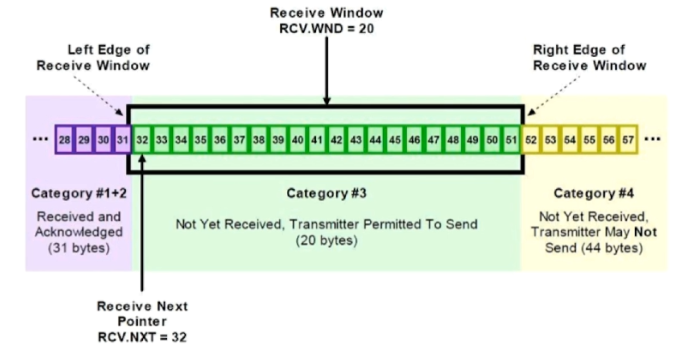

TCP通过下列方式来提供可靠性：

-       应用数据被**分割**成TCP认为最适合发送的数据块。这和UDP完全不同，应用程序产生的数据长度将保持不变。由TCP传递给IP的信息单位称为报文段或段（segment）。
-       当TCP发出一个段后，它启动一个**定时器**，等待目的端确认收到这个报文段。如果不能及时收到一个确认，将重发这个报文段。当TCP收到发自TCP连接另一端的数据，它将发送一个确认。TCP有延迟确认的功能，在此功能没有打开，则是立即确认。功能打开，则由定时器触发确认时间点。
-       TCP将保持它首部和数据的**检验和**。这是一个端到端的检验和，目的是检测数据在传输过程中的任何变化。如果收到段的检验和有差错，TCP将丢弃这个报文段和不确认收到此报文段（希望发端超时并重发）。
-       既然TCP报文段作为IP数据报来传输，而IP数据报的到达可能会失序，因此TCP报文段的到达也可能会失序。如果必要，TCP将对收到的数据进行**重新排序**，将收到的数据以正确的顺序交给应用层。
-       既然IP数据报会发生重复，TCP的接收端必须**丢弃重复的数据**。
-       TCP还能提供**流量控制**。TCP连接的每一方都有固定大小的缓冲空间。TCP的接收端只允许另一端发送接收端缓冲区所能接纳的数据。这将防止较快主机致使较慢主机的缓冲区溢出。

## **差错控制**

TCP使用差错控制来提供可靠性。差错控制包括以下的一些机制：检测和重传受到损伤的报文段、重传丢失的报文段、保存失序到达的报文段直至缺失的报文到期，以及检测和丢弃重复的报文段。

TCP通过三个简单的工具来完成其差错控制：**检验和**、**确认**以及**超时**。

## **通过序列号与确认应答提高可靠性**

-   在 TCP 中，当发送端的数据到达接收主机时，接收端主机会返回一个已收到消息的通知。这个消息叫做确认应答（ACK）。当发送端将数据发出之后会等待对端的确认应答。如果有确认应答，说明数据已经成功到达对端。**反之，则数据丢失的可能性很大**。
-   在一定时间内没有等待到确认应答，发送端就可以认为数据已经丢失，并进行重发。由此，即使产生了丢包，仍然能够保证数据能够到达对端，实现可靠传输。
-   未收到确认应答并不意味着数据一定丢失。也有可能是数据对方已经收到，只是返回的确认应答在途中丢失。这种情况也会导致发送端误以为数据没有到达目的地而重发数据。
-   此外，也有可能因为一些其他原因导致确认应答延迟到达，在源主机重发数据以后才到达的情况也屡见不鲜。此时，源主机只要按照机制重发数据即可。
-   对于目标主机来说，反复收到相同的数据是不可取的。为了对上层应用提供可靠的传输，目标主机必须放弃重复的数据包。为此我们引入了序列号。

## **重传策略**

TCP协议用于控制数据段是否需要重传的依据是设立重发定时器。在发送一个数据段的同时启动一个重传，如果在重传超时前收到确认（Acknowlegement）就关闭该重传，如果重传超时前没有收到确认，则重传该数据段。在选择重发时间的过程中，TCP必须具有自适应性。它需要根据互联网当时的通信情况，给出合适的重发时间。

这种重传策略的关键是对定时器初值的设定。采用较多的算法是Jacobson于1988年提出的一种不断调整超时时间间隔的动态算法。其工作原理是：

对每条连接TCP都保持一个变量RTT（Round Trip Time），用于存放当前到目的端往返所需要时间最接近的估计值。当发送一个数据段时，同时启动连接的定时器，如果在定时器超时前确认到达，则记录所需要的时间（M），并修正RTT的值，如果定时器超时前没有收到确认，则将RTT的值增加1倍。通过测量一系列的RTT（往返时间）值，TCP协议可以估算数据包重发前需要等待的时间。在估计该连接所需的当前延迟时通常利用一些统计学的原理和算法（如Karn算法），从而得到TCP重发之前需要等待的时间值。

## **重传时间间隔的确定**

-   **RTT**:发送一个数据包到收到对应的ACK，所花费的时间。
-   **RTO**:重传时间间隔。**重发超时是指在重发数据之前，等待确认应答到来的那个特定时间间隔。**如果超过这个时间仍未收到确认应答，发送端将进行数据重发。最理想的是，找到一个最小时间，它能保证“确认应答一定能在这个时间内返回”。
-   TCP 要求不论处在何种网络环境下都要提供高性能通信，并且无论网络拥堵情况发生何种变化，都必须保持这一特性。为此，它在每次发包时都会计算往返时间 **RTT **及其偏差。将这个往返时间 **RTT **和偏差时间相加，重传时间间隔 **RTO **就是比这个总和要稍大一点的值。
-   数据被重发之后若还是收不到确认应答，则进行再次发送。此时，等待确认应答的时间将会以2倍、4倍的指数函数延长。
-   数据也不会被持续不断地反复重发。达到一定重发次数之后，如果仍没有任何确认应答返回，就会判断为网络或对端主机发生了异常，强制关闭连接。并且通知应用通信异常强行终止。

## **以段为单位发送数据**

-   在建立 TCP 连接的同时，也可以确定发送数据包的单位，我们也可以称其为“消息长度”（MSS）。最理想的情况是，消息长度正好是 IP 中不会被分片处理的数据长度。
-   TCP 在传送大量数据时，是以 MSS 的大小将数据进行分割发送。进行重发时也是以 MSS 为单位。
-   MSS 在三次握手的时候，在两端主机之间被计算得出。两端的主机在发出建立连接的请求时，会在 TCP 首部中写入 MSS 选项，告诉对方自己的接口能够适应的 MSS 的大小。然后会在两者之间选择一个较小的值投入使用。

## **利用窗口控制提高速度**

-   TCP 以1个段为单位，若每发送一个段进行一次确认应答的处理，则包的往返时间越长通信性能就越低。
-   为解决这个问题，TCP 引入了窗口这个概念：确认应答不再是以每个分段，而是以更大的单位进行确认，转发时间将会被大幅地缩短。也就是说，发送端主机，在发送了一个段以后不必要一直等待确认应答，而是可以继续发送。

     

    窗口大小就是指无需等待确认应答而可以继续发送数据的值。上图中窗口大小为4个段。这个机制实现了使用大量的缓冲区，通过对多个段同时进行确认应答的功能。由于发送方不必每发一个分组就停下来等待确认，因此可以加速数据的传输。

## **滑动窗口控制**

 TCP使用滑动窗口做流量控制与重传：

​    保证TCP的可靠性(确保数据包均已成功发送)

​    保证TCP的**流量控制**特性(通过动态改变窗口大小来调节两台主机间的数据传输，确保接收端的接收速度能够和发送端的发送速度相匹配)

cwnd：发送端窗口(congestion window)

发送方的发送缓存内的数据都可以被分为4类:

1\. 已发送，已收到ACK    2. 已发送，未收到ACK    3. 未发送，但允许发送    4. 未发送，但不允许发送

其中类型2和3都属于发送窗口

rwnd：接收端窗口(receiver window)

接收方的缓存数据分为3类：

1\. 已接收    2. 未接收但准备接收    3. 未接收而且不准备接收

其中类型2属于接收窗口

### **滑动机制**

​    发送窗口只有收到发送窗口内字节的ACK确认，才会移动发送窗口的左边界。接收到的确认号：下一个所期待的字节。

​    接收窗口只有在前面所有的段都确认的情况下才会移动左边界。当在前面还有字节未接收但收到后面字节的情况下，窗口不会移动，并不对后续字节确认。只要当确认字节之前的所有数据都已到达之后才会发送确认，这种方式被称为 **累计确认**。如：接收端可以已获得：0、1、2、4、5、6、7，它会先确认段2(含段2)之前的数据，当发送端超时，会重发段3.因为接收端已缓存了段4到段7，一旦它收到段3，那么可立即确认直到段7的全部字节。

第一次发送数据这个时候的窗口大小是根据链路带宽的大小来决定的。

假设这个时候窗口的大小是3。这个时候接受方收到数据以后会对数据进行确认告诉发送方我下次希望手到的是数据是多少。这里我们看到接收方发送的ACK=3(这是发送方发送序列2的回答确认，下一次接收方期望接收到的是3序列信号)。

这个时候发送方收到这个数据以后就知道我第一次发送的3个数据对方只收到了2个。就知道第3个数据对方没有收到。下次在发送的时候就从第3个数据开始发。

### 流量控制

端到端，接收端的应用层处理速度决定和网速无关，由接收端返回的 rwnd 控制。

通过动态改变窗口大小来调节两台主机间的数据传输，确保接收端的接收速度能够和发送端的发送速度相匹配

-   当rwnd < cwnd 时，是接收方的接收能力限制发送方窗口的最大值。
-   当cwnd < rwnd 时，则是网络的拥塞限制发送方窗口的最大值。
-   发送方窗口的上限值 cwnd = Min \[ rwnd, cwnd \]

## **拥塞控制**

防止过多的数据注入到网络当中，这样可以使网络中的路由器或链路不致过载。

拥塞控制由发送端 cwnd 主动控制，有几种拥塞控制方法：

> -   **慢启动：**从cwnd初始为1开始启动，指数增长
> -   **拥塞避免：**cwnd 到达 ssthresh 后，为了避免拥塞开始尝试 线性增长
> -   **快重传：**接收方每收到一个报文段都要回复一个当前最大连续位置的确认，当后面的序号先到达，如接收方接收到了1、 3、 4，而2没有收到，就会立即向发送方重复发送三次ACK=2的确认请求重传。发送方连续收到3个相同序号的ACK，就重传该数据包，而不用等待超时
> -   **快恢复：**ssthresh 减半，cwnd 直接从ssthresh线性增长

如果网络上的延时突然增加，那么TCP对此的应对只能是重传数据，但重传会导致网络的负担更重，于是会导致更大的延迟以及更多的丢包。

TCP的设计理念：当拥塞发生的时候，要做自我牺牲。就像交通阻塞一样，每个车都应该把路让出来，而不要再去抢路了。

### **慢启动**

当主机开始发送数据时，如果立即将大量数据字节注入到网络，那么就有可能因为不清楚当前网络的负荷情况而引起网络阻塞。所以，最好的方法是先探测一下，即由小到大逐渐增大发送窗口，也就是说，由小到大逐渐增大拥塞窗口数值。通常在刚刚发送报文段时，先把拥塞窗口cwnd设置为一个最大报文段MSS的数值。而在每收到一个新的报文段的确认后，把拥塞窗口增加至多一个MSS的数值。用这样的方法逐步增大发送方的拥塞窗口cwnd，可以使分组注入到网络的速率更加合理。

只有在TCP连接建立和网络出现超时时才使用。每经过一个传输轮次，cwnd 就加倍。一个传输轮次所经历的时间其实就是往返时间 RTT。慢开始的“慢”并不是指cwnd的增长速率慢，而是指在TCP开始发送报文段时先设置 cwnd = 1，使得发送方在开始时只发送一个报文段(目的是试探一下网络的拥塞情况)，然后再逐渐增大cwnd。

为了防止拥塞窗口 cwnd 增长过大引起网络拥塞，还需要设置一个慢开始门限 ssthresh 状态变量。慢开始门限 ssthresh 的用法如下：  
    当 cwnd < ssthresh 时，使用 慢开始算法。  
    当 cwnd > ssthresh 时，停止使用 慢开始算法 而改用 拥塞避免算法。  
    当 cwnd = ssthresh 时，既可使用 慢开始算法，也可使用 拥塞控制避免算法。

### **拥塞避免**：

让拥塞窗口cwnd缓慢地增大，即每经过一个往返时间RTT就把发送方的拥塞窗口cwnd加1，而不是加倍。这样拥塞窗口cwnd按线性规律缓慢增长，比慢开始算法的拥塞窗口增长速率缓慢得多。

无论在慢开始阶段还是在拥塞避免阶段，只要发送方判断网络出现拥塞（其根据就是没有收到确认），就要把慢开始门限ssthresh设置为出现拥塞时的发送方窗口值的一半（但不能小于2）。然后把拥塞窗口cwnd重新设置为1，执行慢开始算法。这样做的目的就是要迅速减少主机发送到网络中的分组数，使得发生拥塞的路由器有足够时间把队列中积压的分组处理完毕。

执行过程：

1）当TCP连接进行初始化时，把拥塞窗口cwnd置为1。

2）在执行慢开始算法时，拥塞窗口cwnd随着传输轮次按指数规律增长。当拥塞窗口cwnd增长到慢开始门限值ssthresh时（即当cwnd=16时），就改为执行拥塞控制算法，拥塞窗口按线性规律增长。

3）当网络发生拥塞，把ssthresh值更新为拥塞前ssthresh值的一半，cwnd重新设置为1，再按照2执行。

如：

a.在TCP连接进行初始化的时候，cwnd = 1，ssthresh = 16;

b.在慢启动算法开始时，cwnd的初始值是1，每次发送方收到一个ACK拥塞窗口就增加1，当ssthresh == cwnd时，启动拥塞控制算法，拥塞窗口按照线性规律增长；

c.当cwnd = 24时，网络出现超时，发送方收不到确认ACK，此时设置ssthresh = 12,设置cwnd = 1,然后开始慢启动算法，当cwnd = ssthresh=12，慢启动算法变为拥塞控制算法，cwnd按照线性速度增长

AIMD（加法增大乘法减小）

a.乘法减小：无论在慢启动阶段还是在拥塞控制阶段，只要网络出现超时，就是将cwnd置为1，sthresh置为cwnd的一半，然后开始执行慢启动算法

b.加法增大：当网络频发出现超时情况时，ssthresh就下降的很快，为了减少注入到网络当中的分组数，而加法增大是执行拥塞避免算法后，是拥塞窗口缓慢的增大，以防止网络过早出现拥塞。

这两个结合起来就是AIMD算法，是使用最广泛的算法。拥塞避免算法不能够完全避免网络y拥塞，通过控制拥塞窗口的大小只能使网络不易出现拥塞。

### 快重传

如果发送方设置的超时计时器时限已到但还未收到确认，那么很可能是网络出现了拥塞，致使报文段在网络中的某处被丢弃。

慢开始和拥塞避免的处理：TCP马上把拥塞窗口 cwnd 减小到1，并执行慢开始算法，同时把慢开始门限值 ssthresh 减半，但仍会出现 TCP连接 因为等待重传计时的超时而空闲较长时间。

快重传算法的处理：接收方收到一个失序的报文段后立刻发出重复确认，而不要等待自己发送数据时才进行捎带确认。

在上图中，接收方成功的接受了发送方发来的M1,M2并且分别发送了ACK，现在接收方没有收到M3，而收到了M4，显然接收方不能确认M4，因为M4是失序的报文段。

如果根据可靠性传输原理，接收方什么都不做。

按照快速重传算法，在收到M4,M5等报文段的时候，不断重复的向发送方发送M2的ACK，这样做可以让发送方及早知道报文段M3没有到达接收方。

快重传算法还规定了，如果接收方一连收到三个重复的ACK，那么发送方不必等待重传计时器到期，而是立即重传未被确认的报文段。

由于发送方尽早重传未被确认的报文段，因此采用快重传后可以使整个网络吞吐量提高约20%。

### 快恢复

与快重传配合使用的还有快恢复算法，其过程有以下两个要点：

1\. 当发送方连续收到三个重复确认，就执行“乘法减小”算法，把慢启动门限ssthresh减半。这是为了预防网络发生拥塞。

2\. 由于发送方现在认为网络很可能没有发生拥塞，因此与慢开始不同之处是现在不执行慢开始算法（即拥塞窗口cwnd现在不设置为1），而是把cwnd值设置为慢开始门限 ssthresh 减半后的数值，然后开始执行拥塞避免算法（“加法增大”），使拥塞窗口缓慢地线性增大。