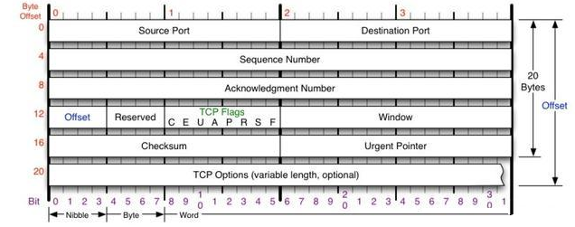
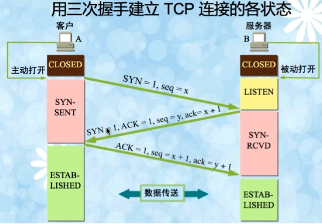

在OSI 模型中分为了 7 层，但是在TCP/IP 协议中，分为了 4层。

1)应用层、表示层、会话层三个层次提供的服务相差不是很大，所以在TCP/IP协议中，它们被合并为应用层一个层次。

2)由于传输层和网络层在网络协议中的地位十分重要，所以在TCP/IP协议中它们被作为独立的两个层次.

3)因为数据链路层和物理层的内容相差不多，所以在TCP/IP协议中它们被归并在网络接口层一个层次里。只有四层体系结构的TCP/IP协议，与有七层体系结构的OSI相比要简单了不少，也正是这样，TCP/IP协议在实际的应用中效率更高，成本更低。

#### **链路层**

    以太网协议规定，接入网络的设备都必须安装网络适配器，即 网卡，数据包必须是从一块网卡传送到另一块网卡。而网卡地址就是数据包的发送地址和接收地址，有了MAC地址以后，以太网采用广播形式，把数据包发给该子网内所有主机，子网内每台主机在接收到这个包以后，都会读取首部里的目标MAC地址，然后和自己的MAC地址进行对比，如果相同就做下一步处理，如果不同，就丢弃这个包。 
    
    链路层的主要工作就是对电信号进行分组并形成具有特定意义的数据帧，然后以广播的形式通过物理介质发送给接收方。

#### 网络层

**IP协议**

    IP协议是无连接的。它不会占用两个通信计算机的通信线路，从而降低了对网络线路的需求。每条线路都可以同时满足多个计算机的通信需要。IP层只负责数据的路由和传输，在源节点与目的节点之间传送数据报，但并不处理数据内容。数据报中有目的地址等必要内容，使每个数据报经过不同的路径也能准确地到达目的地，在目的地重新组合还原成原来发送的数据。
    
    虽然IP协议保证了计算机之间可以发送和接收数据包，但它不负责解决数据报传达的可靠性等安全问题，这些安全因素主要由它的上层协议：TCP协议 来负责完成。 
    
    IP的主要目的是通过一个互联的网络传输数据报，涉及两个最基本的功能。

-   寻址(Addressing)：IP协议根据数据报首部中包括的目的地址将数据报传送到目的节点，这就要涉及传送路径的选择，即路由功能。IP协议使用IP地址来实现路由。
-   分片(Fragmentation)：IP协议还提供对数据大小的分片和重组，以适应不同网络对数据包大小的限制。如果网络只能传送小数据包，IP协议将对数据报进行分段并重新组成小块再进行传送。

    网络层引入了IP协议，制定了一套新地址，使得我们能够区分两台主机是否同属一个网络，这套地址就是网络地址，也就是所谓的IP地址。IP协议将这个32位的地址分为两部分，前面部分代表网络地址，后面部分表示该主机在局域网中的地址。如果两个IP地址在同一个子网内，则网络地址一定相同。为了判断IP地址中的网络地址，IP协议还引入了子网掩码，IP地址和子网掩码通过按位与运算后就可以得到网络地址。

    **ARP协议、路由协议 此处省略... ...**

    网络层的主要工作是定义网络地址、区分网段、子网内MAC寻址、对于不同子网的数据包进行路由。

#### 传输层

    链路层定义了主机的身份，即MAC地址，而网络层定义了IP地址，明确了主机所在的网段，有了这两个地址，数据包就从可以从一个主机发送到另一台主机。
    
    实际上数据包是从一个主机的某个应用程序发出，然后由对方主机的应用程序接收。而每台电脑都有可能同时运行着很多个应用程序，所以当数据包被发送到主机上以后，是无法确定哪个应用程序要接收这个包。因此传输层引入了 UDP 协议来解决这个问题，为了给每个应用程序标识身份。

**UDP协议**

    UDP协议定义了端口，同一个主机上的每个应用程序都需要指定唯一的端口号，并且规定网络中传输的数据包必须加上端口信息，当数据包到达主机以后，就可以根据端口号找到对应的应用程序了。UDP协议比较简单，实现容易，但它没有确认机制，数据包一旦发出，无法知道对方是否收到，因此可靠性较差，为了解决这个问题，提高网络可靠性，TCP协议就诞生了。
    
    它主要用于不要求分组顺序到达的传输中，分组传输顺序的检查与排序由应用层完成，提供面向事务的简单不可靠信息传送服务。UDP 协议基本上是IP协议与上层协议的接口。UDP协议适用端口分别运行在同一台设备上的多个应用程序。
    
    在网络质量令人十分不满意的环境下，UDP协议数据包丢失会比较严重。但是由于UDP的特性：它不属于连接型协议，因而具有资源消耗小，处理速度快的优点，所以通常音频、视频和普通数据在传送时使用UDP较多，因为它们即使偶尔丢失一两个数据包，也不会对接收结果产生太大影响。比如我们聊天用的ICQ和QQ就是使用的UDP协议。

**TCP协议**

    面向连接的、可靠的、基于字节流的传输层通信协议。它是为了在不可靠的互联网络上提供可靠的端到端字节流而专门设计的一个传输协议。不同主机的应用层之间经常需要可靠的、像管道一样的连接，但是IP层不提供这样的流机制，而是提供不可靠的包交换。
    
    简单来说TCP就是有确认机制的UDP协议，每发出一个数据包都要求确认，如果有一个数据包丢失，就收不到确认，发送方就必须重发这个数据包。为了保证传输的可靠性，TCP协议在UDP基础之上建立了三次对话的确认机制，即在正式收发数据前，必须和对方建立可靠的连接。TCP数据包和UDP一样，都是由首部和数据两部分组成，唯一不同的是，TCP数据包没有长度限制，理论上可以无限长，但是为了保证网络的效率，通常TCP数据包的长度不会超过IP数据包的长度，以确保单个TCP数据包不必再分割。

> 1.  应用层向TCP层发送用于网间传输的、用8位字节表示的数据流，然后TCP把数据流分区成适当长度的报文段（通常受该计算机连接的网络的数据链路层的最大传输单元（MTU）的限制）。
> 2.  TCP把结果包传给IP层，由它来通过网络将包传送给接收端实体的TCP层。
> 3.  TCP为了保证不发生丢包，就给每个包一个序号，同时序号也保证了传送到接收端实体的包的按序接收。
> 4.  接收端实体对已成功收到的包发回一个相应的确认（ACK）；如果发送端实体在合理的往返时延（RTT）内未收到确认，那么对应的数据包就被假设为已丢失将会被进行重传。
> 5.  TCP用一个校验和函数来检验数据是否有错误；在发送和接收时都要计算校验和。

**TCP报文头**

> TCP的包是没有IP地址的，那是IP层上的事。
>
> Source Port是源端口，16位。
>
> Destination Port是目的端口，16位。
>
> Sequence Number是发送数据包中的第一个字节的序列号，32位。
>
> Acknowledgment Number是确认序列号，32位。
>
> offset是数据偏移，4位，该字段的值是TCP首部（包括选项）长度除以4。
>
> reserved： 6位。保留域，留给之后使用的。
>
> TCP Flags：C E U A P R S F 
>
> -   C reduced    CWR
> -   E ECN Echo    ECE
> -   U Urgent    紧急指针标志，表示Urgent Pointer字段有意义
> -   A Ack    确认序号标志，表示Acknowledgment Number字段有意义
> -   P Push    表示Push功能
> -   R Reset    表示复位TCP连接
> -   S Syn    表示SYN报文（在建立TCP连接的时候使用）
> -   F Fin    表示没有数据需要发送了（在关闭TCP连接的时候使用）
>
> Window表示接收缓冲区的空闲空间，16位，用来告诉TCP连接对端自己能够接收的最大数据长度。
>
> Checksum是校验和，16位。
>
> Urgent Pointers是紧急指针，16位。只有Urgent 标志位被设置为1时该字段才有意义，表示紧急数据相对序列号（Sequence Number字段的值）的偏移。
>
> TCP options 其长度可变，定义一些其他的可选参数。

#### **三次握手**

-   TCP是全双工通信协议 (通信的双方可以同时发送和接收信息的信息交互方式)。在数据通信开始之前先做好两端之间的准备工作。
-   所谓三次握手是指建立一个 TCP 连接时需要客户端和服务器端总共发送三个包以确认连接的建立。在socket编程中，这一过程由客户端执行connect来触发。

**建立连接**

TCP是因特网中的传输层协议，使用三次握手协议建立连接。当主动方发出SYN连接请求后，等待对方回答SYN+ACK，并最终对 对方的 SYN 执行 ACK 确认。这种建立连接的方法可以防止产生错误的连接，TCP使用的流量控制协议 是 可变大小的滑动窗口协议。

TCP三次握手的过程如下：

第一次握手：客户端发送SYN(seq=x)报文给服务器端，进入SYN_SEND状态，等待服务器确认。

第二次握手：服务器端收到SYN报文，回应一个SYN(seq=y),ACK(ack=x+1)报文，进入SYN_RECV状态。

第三次握手：客户端收到服务器端的SYN报文，回应一个ACK(ack=y+1)报文，进入Established状态。

三次握手完成，TCP客户端和服务器端成功地建立连接，可以开始传输数据了。

(大写的 SYN = 1 和 ACK = 1  表示 此时的标志位为1)

**为了需要三次握手才能建立起连接？**

为了初始化 Sequence Number 的初始值。通信的双方，需要互相通知给对方知道自己的 Sequence Number的初始值，也就是上图的 x 和 y，用来作为以后数据通信的序号，保证应用层接收到的数据不会因为网络的传输问题而乱序。即 TCP 会用这个序号来拼接数据，因此在第二次握手之后，客户端还需要发送确认报文给服务器，告知服务器：客户端已收到你的发送的 Sequence Number 。

可能出现的问题：

1.在客户端发送SYN后，如果服务端一直不回应SYN+ACK报文，客户端会不断的重传SYN报文直到超过一定的重传次数或超时时间。

2.在客户端发送SYN后，服务端回应SYN+ACK报文，但客户端不再回复ACK，服务端也会一直重传直到超过一定的重传次数或超时时间。linux 默认等待63秒才断开连接 (可能会导致服务器遭到SYN报文攻击，攻击者从而耗尽 SYN 的连接队列，让正常请求的连接无法处理) 

**syn flood攻击**

​    当开放了一个TCP端口后，该端口就处于Listening状态，不停地监视发到该端口的Syn报文，一 旦接收到Client发来的Syn报文，就需要为该请求分配一个TCB，通常一个TCB至少需要280个字节，在某些操作系统中TCB甚至需要1300个字节，并返回一个SYN ACK命令，立即转为SYN-RECEIVED即半开连接状态。

​    如果恶意的向某个服务器端口发送大量的SYN包，则可以使服务器打开大量的半开连接，分配TCB（Transmission Control Block）, 从而消耗大量的服务器资源，同时也使得正常的连接请求无法被相应。

​    常见的防攻击方法有：

​    1.**无效连接的监视释放**

​        监视系统的半开连接和不活动连接，当达到一定阈值时拆除这些连接，从而释放系统资源。这种方法对于所有的连接一视同仁，而且由于SYN Flood造成的半开连接数量很大，正常连接请求也被淹没在其中被这种方式误释放掉，因此这种方法属于入门级的SYN Flood方法。

​    2.**延缓TCB分配方法**

​        消耗服务器资源主要是因为当SYN数据报文一到达，系统立即分配TCB，从而占用了资源。而SYN Flood由于很难建立起正常连接，因此，当正常连接建立起来后再分配TCB则可以有效地减轻服务器资源的消耗。常见的方法是使用Syn Cache和Syn Cookie技术。

​    **2.1Syn Cache技术**

​        系统在收到一个SYN报文时，在一个专用HASH表中保存这种半连接信息，直到收到正确的回应ACK报文再分配TCB。这个开销远小于TCB的开销。当然还需要保存序列号。

​    **2.2Syn Cookie技术**

​        Syn Cookie技术则完全不使用任何存储资源，这种方法比较巧妙，它使用一种特殊的算法生成Sequence Number，这种算法考虑到了对方的IP、端口、己方IP、端口的固定信息，以及对方无法知道而己方比较固定的一些信息，如MSS(Maximum Segment Size，最大报文段大小，指的是TCP报文的最大数据报长度，其中不包括TCP首部长度.)、时间等，在收到对方 的ACK报文后，重新计算一遍，看其是否与对方回应报文中的（Sequence Number-1）相同，从而决定是否分配TCB资源。

**如果已经建立了连接，但是客户端突然出现故障了怎么办？**

保活机制:若在一段时间内，连接处于非活动状态，则向对方发送保活探测报文，如果发送端未收到响应报文，则在下一个保活时间点，再次尝试发送保活探测报文。若尝试次数达到保活探测数，仍未收到响应报文，则断开连接。

TCP设有一个保活计时器，显然，客户端如果出现故障，服务器不能一直等下去，白白浪费资源。服务器每收到一次客户端的请求后都会重新复位这个计时器，时间通常是设置为2小时，若两小时还没有收到客户端的任何数据，服务器就会发送一个探测报文段，以后每隔75秒钟发送一次。若一连发送10个探测报文仍然没反应，服务器就认为客户端出了故障，接着就关闭连接。

**为什么不能用两次握手进行连接？**

3次握手完成两个重要的功能，既要双方做好发送数据的准备工作(双方都知道彼此已准备好)，也要允许双方就初始序列号进行协商，这个序列号在握手过程中被发送和确认。

现在把三次握手改成仅需要两次握手，死锁是可能发生的。作为例子，考虑计算机S和C之间的通信，假定C给S发送一个连接请求分组，S收到了这个分组，并发送了确认应答分组。按照两次握手的协定，S认为连接已经成功地建立了，可以开始发送数据分组。

可是，C在S的应答分组在传输中被丢失的情况下(即服务端发送给客户端的ACK丢失)，将不知道S 是否已准备好，不知道S建立什么样的序列号，C甚至怀疑S是否收到自己的连接请求分组。在这种情况下，C认为连接还未建立成功，将忽略S发来的任何数据分组，只等待连接确认应答分组。而S在发出的分组超时后，重复发送同样的分组。这样就形成了死锁。