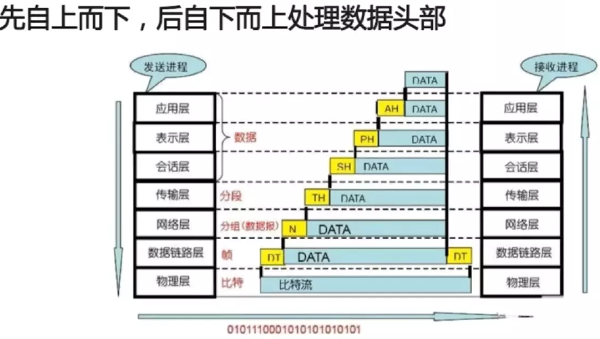
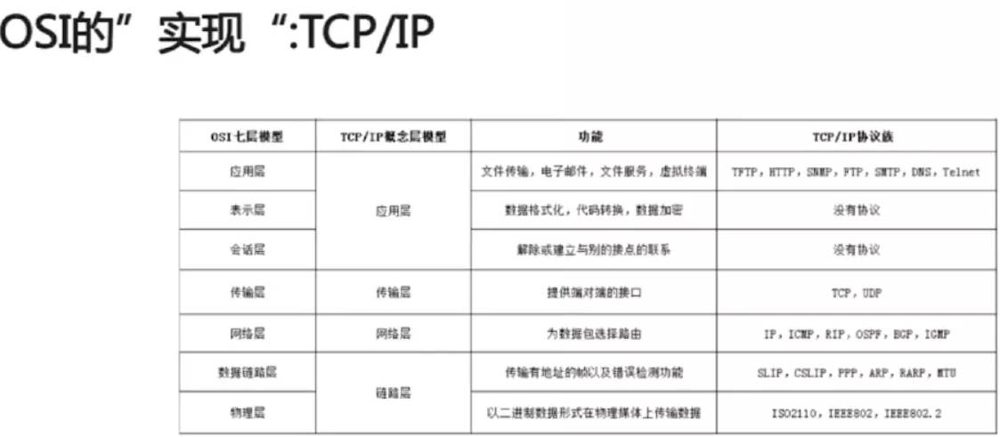
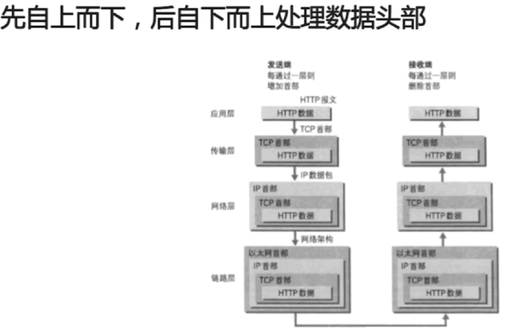
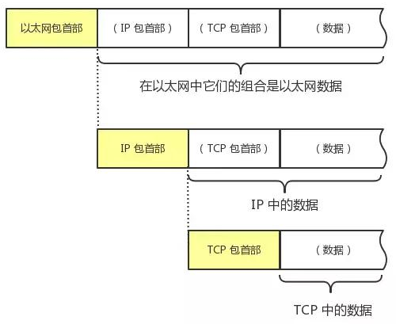
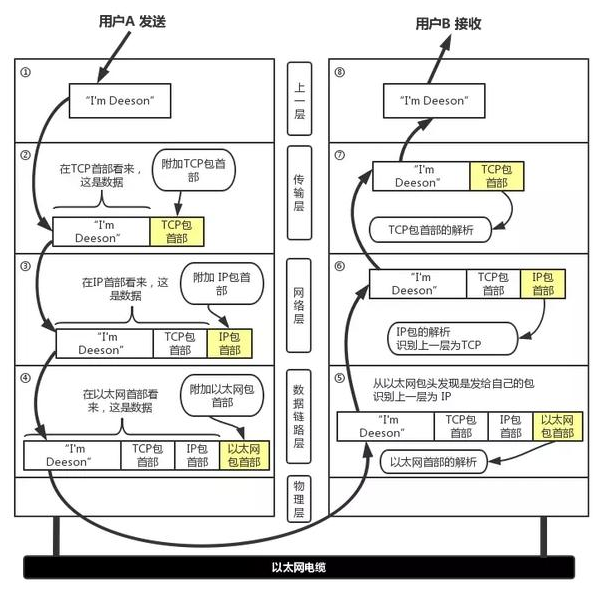

物理层：

    实际最终信号的传输是通过物理层实现的。通过物理介质传输比特流。规定了电平、速度和电缆针脚。常用设备有（各种物理设备）集线器、中继器、调制解调器、网线、双绞线、同轴电缆。这些都是物理层的传输介质。
    
    它主要关心的是通过物理链路从一个节点向另一个节点传送比特流，物理链路可能是铜线、卫星、微波或其他的通讯媒介。主要作用是进行传输比特流，即：0101二进制数据，先将它们转换为电流强弱来进行传输，到达目的后再把它转成0101的机器码。经历了 数模转换 与 模数转换 的步骤，网卡就是工作在这一层的。

数据链路层：

    在传输比特流的过程中，会产生错传、数据传输不完整的可能，数据链路层定义了如何格式化数据以进行传输，以及如何控制对物理介质的访问。通常，还会提供对错误介质的检测和纠正，以确保数据传输的可靠性。本层将比特组合成字节,再将字节组合成帧,使用链路层地址 (以太网使用MAC地址)来访问介质,并进行差错检测。
    
    数据链路层是为网络层提供服务的，解决两个相邻结点之间的通信问题，传送的协议数据单元称为数据帧。该层的主要作用是通过校验、确认和反馈重发等手段，将不可靠的物理链路转换成对网络层来说无差错的数据链路。此外，数据链路层还要协调收发双方的数据传输速率，即进行[流量控制](https://www.baidu.com/s?wd=%E6%B5%81%E9%87%8F%E6%8E%A7%E5%88%B6&tn=SE_PcZhidaonwhc_ngpagmjz&rsv_dl=gh_pc_zhidao)，以防止接收方因来不及处理发送方来的高速数据而导致缓冲器溢出及线路阻塞。交换机工作在这一层。

网络层：

    随着网络节点的不断增加，点对点通信的时候，是需要经过多个节点的。如何找到目标节点，如何选择最佳路径，便成为了首要需求。
    
    网络层是为传输层提供服务的，传送的协议数据单元称为数据包或分组。将网络地址翻译成物理地址，并将决定如何将数据从发送方路由到接收方。
    
    网络层通过综合考虑发送优先权，网络拥塞程度，服务质量以及可选择路由的花费，来决定从一个网络中节点A到另一个网络中节点B的最佳路径。通过IP寻址来建立两个节点之间的连接，为源端的运输层送来的分组，选择合适的路由和交换节点，正确无误地按照地址传送给目的端的运输层。路由器工作在这一层。需要关注 "IP" 协议。

传输层

    随着网络通信的需求进一步扩大，通信过程中，会发送大量的数据。如海量文件传输，可能需要很长时间。网络在通信过程中，会中断好多次。为了保证传输大量文件的准确性，需要对发送的文件进行切割，切割成一个一个的段落。即segment 进行发送。其中一个段落丢失，是否重传？每个段落到达的顺序是否有序？这便是传输层考虑的问题。
    
    传输层的作用是为上层协议提供端到端的可靠和透明的数据传输服务，包括处理差错控制和[流量控制](https://www.baidu.com/s?wd=%E6%B5%81%E9%87%8F%E6%8E%A7%E5%88%B6&tn=SE_PcZhidaonwhc_ngpagmjz&rsv_dl=gh_pc_zhidao)等问题。该层向高层屏蔽了下层数据通信的细节，使高层用户看到的只是在两个传输实体间的一条主机到主机的、可由用户控制和设定的、可靠的数据通路。
    
    按照网络能处理的最大尺寸将较长的数据包进行强制分割。发送方节点的传输层将数据分割成交小 的数据片，同时对每一个数据片安排一个序列号，以便数据到达接收方的传输层时能以正确的顺序重组，该过程称为排序。
    
    需要关注 TCP/IP协议套中的TCP(传输控制协议) 和 UDP 协议。

会话层

    为了上层协议，不需要每次通信都要去自己调用TCP协议，然后调用 IP协议去找路由。 需要建立一个自动收发包，自动寻址的功能， 于是出现了会话层。
    
    会话层就是负责建立、管理和终止 表示层实体 之间的通信会话。该层的通信由不同设备中的应用程序之间的服务请求和响应组成。保证了应用程序自动收发包、自动寻址。

表示层

    为了解决不同系统的通信语法不同的问题，在表示层，数据需要按照网络所能理解的方案的进行格式化。这种格式化因为所使用网络的类型的不同而不同。 
    
    表示层处理流经结点的数据编码的表示方式问题，以保证一个系统应用层发出的信息可被另一系统的应用层读出。如果必要，该层可提供一种标准表示形式，用于将计算机内部的多种数据表示格式转换成网络通信中采用的标准表示形式。数据压缩和加密也是表示层可提供的转换功能之一。

应用层

    发送方知道自己发送的是什么东西，转换为字节数组之后有多长，但接收方此时却是不知道的，所以应用层网络协议诞生了。应用层规定了发送方必须使用一个固定长度的消息头，消息头必须记录消息体的长度等一系列信息，以确保接收方能够正确的解析发送方发送的数据。没有该层，两台服务器也是可以互相传递数据的。只是传递的只是一堆由0和1组成的字节数组。
    
    应用层是OSI参考模型的最高层，是用户与网络的接口，为用户直接提供各种网络服务。该层通过负责提供数据接口标准，来完成网络用户的应用需求，常见应用层的网络服务协议有：HTTP，HTTPS，FTP，POP3、SMTP等，从而完成 文件传输、收发电子邮件等服务。

### OSI

    OSI 在传输过程中，每个分层中，都会对所发送的数据附加一个首部。

    ISO/OSI参考模型并没有提供一个可以实现的方法。ISO/OSI参考模型只是描述了一些概念，用来协调进程间通信标准的制定。在OSI范围内，只有在各种的协议是可以被实现的而各种产品只有和OSI的协议相一致才能互连。这也就是说，OSI参考模型并不是一个标准，而只是一个在制定标准时所使用的概念性的框架。

### TCP/IP

    从字面意义上讲，有人可能会认为 TCP/IP 是指 TCP 和 IP 两种协议。实际生活当中有时也确实就是指这两种协议。然而在很多情况下，它只是利用 IP 进行通信时所必须用到的协议群的统称。具体来说，IP 或 ICMP、TCP 或 UDP、TELNET 或 FTP、以及 HTTP 等都属于 TCP/IP 协议。

**TCP/IP 与 OSI 在分层模块上稍有区别。OSI 参考模型注重“通信协议必要的功能是什么”，而 TCP/IP 则更强调“在计算机上实现协议应该开发哪种程序”。**

    和OSI一样，在数据传输过程中，每个分层中，都会对所发送的数据附加一个首部，在这个首部中包含了该层必要的信息，如发送的目标地址以及协议相关信息。通常，为协议提供的信息为包首部，所要发送的内容为数据。在下一层的角度看，从上一层收到的包全部都被认为是本层的数据。
    
    网络中传输的数据包由两部分组成：一部分是协议所要用到的首部，另一部分是上一层传过来的数据。首部的结构由协议的具体规范详细定义。在数据包的首部，明确标明了协议应该如何读取数据。反过来说，看到首部，也就能够了解该协议必要的信息以及所要处理的数据。

**数据处理流程**

    下图以用户 a 向用户 b 发送邮件为例子：

① 应用程序处理

​    首先应用程序会进行编码处理，这些编码相当于 OSI 的表示层功能；

​    编码转化后，邮件不一定马上被发送出去，这种何时建立通信连接何时发送数据的管理功能，相当于 OSI 的会话层功能。

② TCP 模块的处理

​    TCP 根据应用的指示，负责建立连接、发送数据以及断开连接。TCP 提供将应用层发来的数据顺利发送至对端的可靠传输。为了实现这一功能，需要在应用层数据的前端附加一个 TCP 首部。

③ IP 模块的处理

​    IP 将 TCP 传过来的 TCP 首部和 TCP 数据合起来当做自己的数据，并在 TCP 首部的前端加上自己的 IP 首部。IP 包生成后，参考路由控制表决定接受此 IP 包的路由或主机。

④ 网络接口（以太网驱动）的处理

​    从 IP 传过来的 IP 包对于以太网来说就是数据。给这些数据附加上以太网首部并进行发送处理，生成的以太网数据包将通过物理层传输给接收端。

⑤ 网络接口（以太网驱动）的处理

​    主机收到以太网包后，首先从以太网包首部找到 MAC 地址判断是否为发送给自己的包，若不是则丢弃数据。

​    如果是发送给自己的包，则从以太网包首部中的类型确定数据类型，再传给相应的模块，如 IP、ARP 等。这里的例子则是 IP 。

⑥ IP 模块的处理

​    IP 模块接收到 数据后也做类似的处理。从包首部中判断此 IP 地址是否与自己的 IP 地址匹配，如果匹配则根据首部的协议类型将数据发送给对应的模块，如 TCP、UDP。这里的例子则是 TCP。

​    对于有路由器的情况，接收端地址往往不是自己的地址，此时，需要借助路由控制表，在调查应该送往的主机或路由器之后再进行转发数据。

⑦ TCP 模块的处理

​    在 TCP 模块中，首先会计算一下校验和，判断数据是否被破坏。然后检查是否在按照序号接收数据。***检查端口号，确定具体的应用程序。数据被完整地接收以后，会传给由端口号识别的应用程序。

⑧ 应用程序的处理

​    接收端应用程序会直接接收发送端发送的数据。通过解析数据，展示相应的内容。